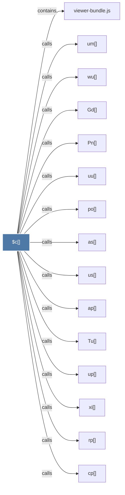

# $c()

> [!info] Properties
> **File Type**: code
> **Community**: [[_COMMUNITY_Community None|Community None]]
> **Degree**: 24

## Architecture Graph


## Outbound Connections
- [[Av()]] - `calls` [EXTRACTED]
- [[Gd()]] - `calls` [EXTRACTED]
- [[Mv()]] - `calls` [EXTRACTED]
- [[N()]] - `calls` [INFERRED]
- [[Om()]] - `calls` [EXTRACTED]
- [[Pn()]] - `calls` [EXTRACTED]
- [[Tu()]] - `calls` [EXTRACTED]
- [[a0()]] - `calls` [EXTRACTED]
- [[ap()]] - `calls` [EXTRACTED]
- [[as()]] - `calls` [EXTRACTED]
- [[cp()]] - `calls` [EXTRACTED]
- [[hy()]] - `calls` [EXTRACTED]
- [[mr()]] - `calls` [EXTRACTED]
- [[op()]] - `calls` [EXTRACTED]
- [[po()]] - `calls` [EXTRACTED]
- [[qs()]] - `calls` [EXTRACTED]
- [[rp()]] - `calls` [EXTRACTED]
- [[um()]] - `calls` [EXTRACTED]
- [[up()]] - `calls` [EXTRACTED]
- [[us()]] - `calls` [EXTRACTED]
- [[uu()]] - `calls` [EXTRACTED]
- [[viewer-bundle.js]] - `contains` [EXTRACTED]
- [[wu()]] - `calls` [EXTRACTED]
- [[xi()]] - `calls` [EXTRACTED]

## Inbound Dependencies
> [!abstract]- Files that link here
```dataview
LIST
FROM [[$c()]]
```

#graphify/code #graphify/EXTRACTED #community/Community_None