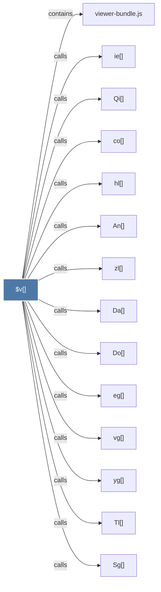

# $v()

> [!info] Properties
> **File Type**: code
> **Community**: [[_COMMUNITY_Community None|Community None]]
> **Degree**: 14

## Architecture Graph


## Outbound Connections
- [[An()]] - `calls` [EXTRACTED]
- [[Da()]] - `calls` [EXTRACTED]
- [[Do()]] - `calls` [EXTRACTED]
- [[Qi()]] - `calls` [EXTRACTED]
- [[Sg()]] - `calls` [EXTRACTED]
- [[Tl()]] - `calls` [EXTRACTED]
- [[co()]] - `calls` [EXTRACTED]
- [[eg()]] - `calls` [EXTRACTED]
- [[hl()]] - `calls` [EXTRACTED]
- [[ie()]] - `calls` [EXTRACTED]
- [[vg()]] - `calls` [EXTRACTED]
- [[viewer-bundle.js]] - `contains` [EXTRACTED]
- [[yg()]] - `calls` [EXTRACTED]
- [[zl()]] - `calls` [EXTRACTED]

## Inbound Dependencies
> [!abstract]- Files that link here
```dataview
LIST
FROM [[$v()]]
```

#graphify/code #graphify/EXTRACTED #community/Community_None