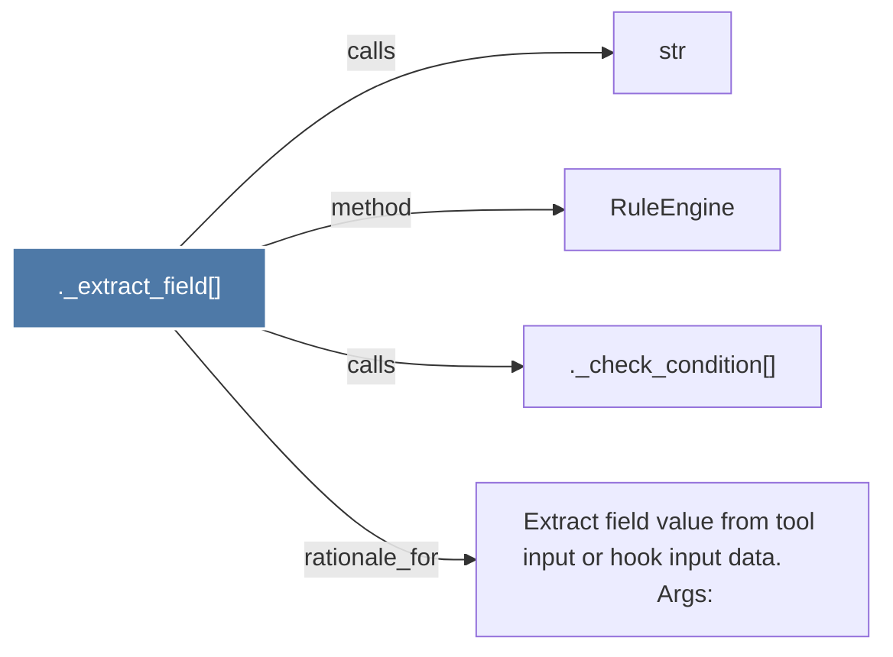

# ._extract_field()

> [!info] Properties
> **File Type**: code
> **Community**: [[_COMMUNITY_Community None|Community None]]
> **Degree**: 4

## Architecture Graph


## Outbound Connections
- [[._check_condition()]] - `calls` [EXTRACTED]
- [[Extract field value from tool input or hook input data.          Args]] - `rationale_for` [EXTRACTED]
- [[RuleEngine]] - `method` [EXTRACTED]
- [[str]] - `calls` [INFERRED]

## Inbound Dependencies
> [!abstract]- Files that link here
```dataview
LIST
FROM [[._extract_field()]]
```

#graphify/code #graphify/EXTRACTED #community/Community_None