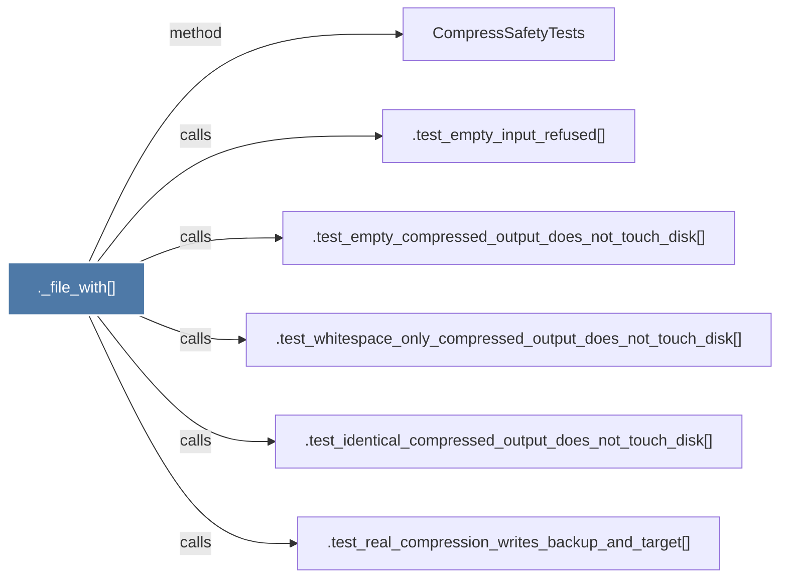

# ._file_with()

> [!info] Properties
> **File Type**: code
> **Community**: [[_COMMUNITY_Community None|Community None]]
> **Degree**: 6

## Architecture Graph


## Outbound Connections
- [[.test_empty_compressed_output_does_not_touch_disk()]] - `calls` [EXTRACTED]
- [[.test_empty_input_refused()]] - `calls` [EXTRACTED]
- [[.test_identical_compressed_output_does_not_touch_disk()]] - `calls` [EXTRACTED]
- [[.test_real_compression_writes_backup_and_target()]] - `calls` [EXTRACTED]
- [[.test_whitespace_only_compressed_output_does_not_touch_disk()]] - `calls` [EXTRACTED]
- [[CompressSafetyTests]] - `method` [EXTRACTED]

## Inbound Dependencies
> [!abstract]- Files that link here
```dataview
LIST
FROM [[._file_with()]]
```

#graphify/code #graphify/EXTRACTED #community/Community_None