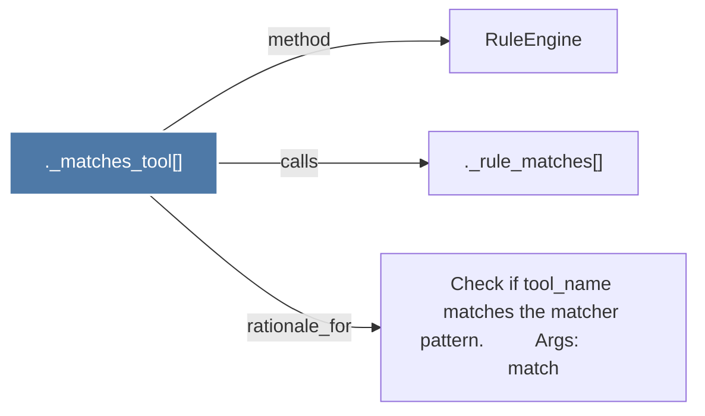

# ._matches_tool()

> [!info] Properties
> **File Type**: code
> **Community**: [[_COMMUNITY_Community None|Community None]]
> **Degree**: 3

## Architecture Graph


## Outbound Connections
- [[._rule_matches()]] - `calls` [EXTRACTED]
- [[Check if tool_name matches the matcher pattern.          Args             match]] - `rationale_for` [EXTRACTED]
- [[RuleEngine]] - `method` [EXTRACTED]

## Inbound Dependencies
> [!abstract]- Files that link here
```dataview
LIST
FROM [[._matches_tool()]]
```

#graphify/code #graphify/EXTRACTED #community/Community_None