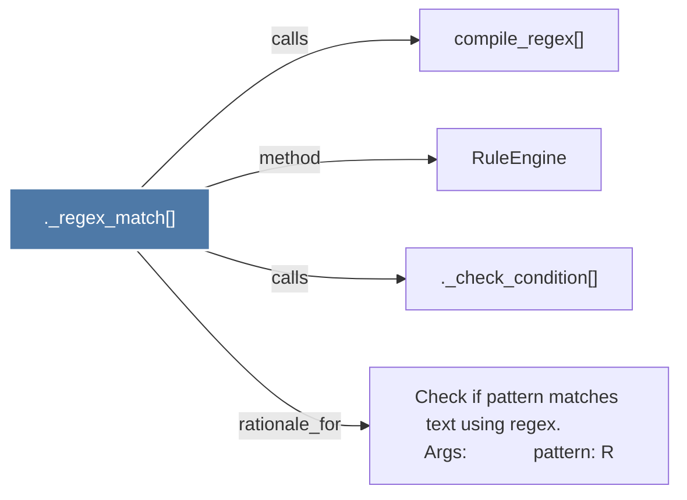

# ._regex_match()

> [!info] Properties
> **File Type**: code
> **Community**: [[_COMMUNITY_Community None|Community None]]
> **Degree**: 4

## Architecture Graph


## Outbound Connections
- [[._check_condition()]] - `calls` [EXTRACTED]
- [[Check if pattern matches text using regex.          Args             pattern R]] - `rationale_for` [EXTRACTED]
- [[RuleEngine]] - `method` [EXTRACTED]
- [[compile_regex()]] - `calls` [EXTRACTED]

## Inbound Dependencies
> [!abstract]- Files that link here
```dataview
LIST
FROM [[._regex_match()]]
```

#graphify/code #graphify/EXTRACTED #community/Community_None