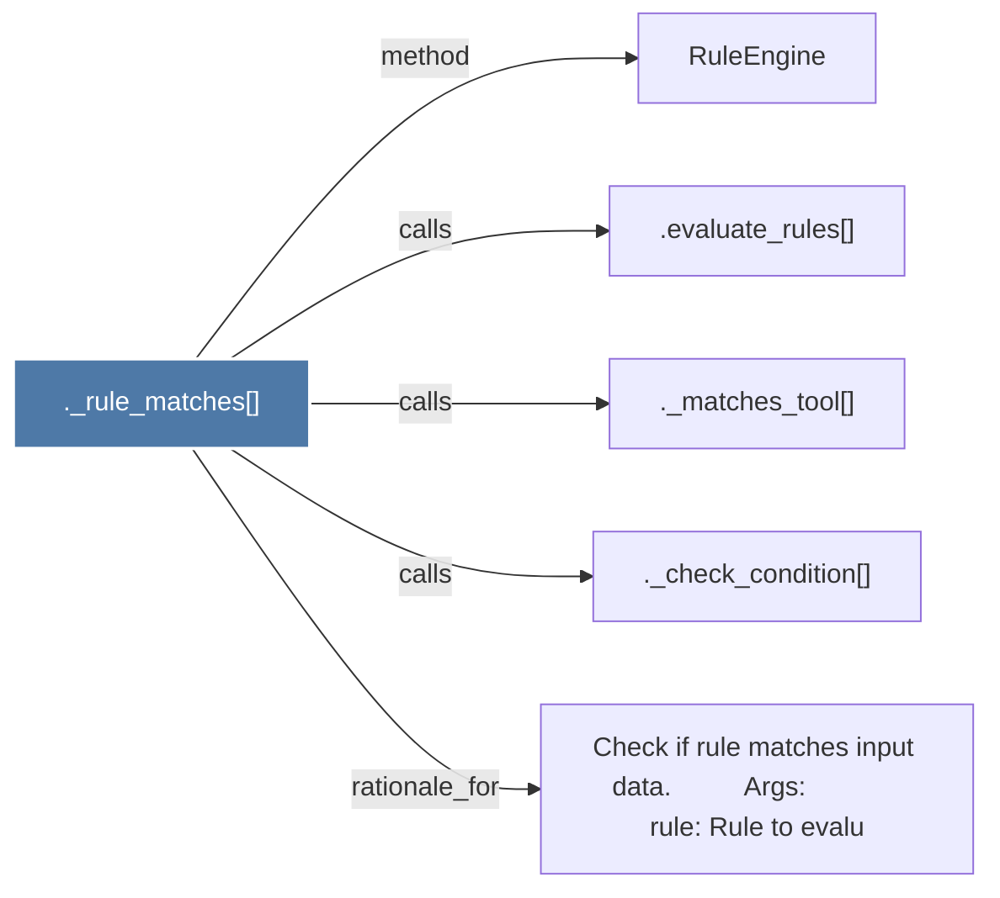

# ._rule_matches()

> [!info] Properties
> **File Type**: code
> **Community**: [[_COMMUNITY_Community None|Community None]]
> **Degree**: 5

## Architecture Graph


## Outbound Connections
- [[._check_condition()]] - `calls` [EXTRACTED]
- [[._matches_tool()]] - `calls` [EXTRACTED]
- [[.evaluate_rules()]] - `calls` [EXTRACTED]
- [[Check if rule matches input data.          Args             rule Rule to evalu]] - `rationale_for` [EXTRACTED]
- [[RuleEngine]] - `method` [EXTRACTED]

## Inbound Dependencies
> [!abstract]- Files that link here
```dataview
LIST
FROM [[._rule_matches()]]
```

#graphify/code #graphify/EXTRACTED #community/Community_None