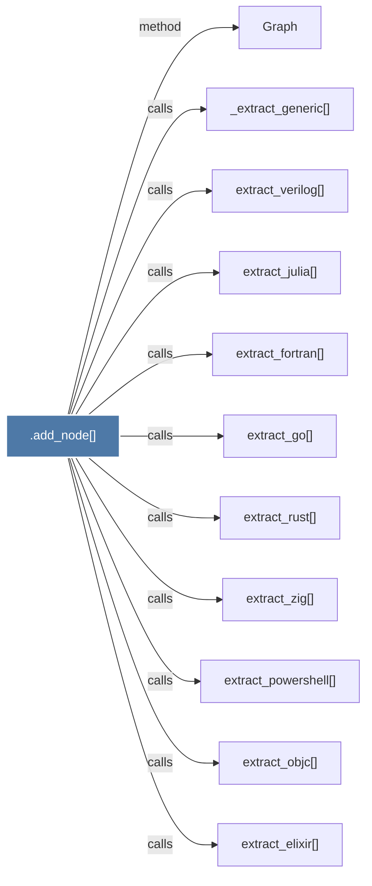

# .add_node()

> [!info] Properties
> **File Type**: code
> **Community**: [[_COMMUNITY_Community None|Community None]]
> **Degree**: 11

## Architecture Graph


## Outbound Connections
- [[Graph]] - `method` [EXTRACTED]
- [[_extract_generic()]] - `calls` [INFERRED]
- [[extract_elixir()]] - `calls` [INFERRED]
- [[extract_fortran()]] - `calls` [INFERRED]
- [[extract_go()]] - `calls` [INFERRED]
- [[extract_julia()]] - `calls` [INFERRED]
- [[extract_objc()]] - `calls` [INFERRED]
- [[extract_powershell()]] - `calls` [INFERRED]
- [[extract_rust()]] - `calls` [INFERRED]
- [[extract_verilog()]] - `calls` [INFERRED]
- [[extract_zig()]] - `calls` [INFERRED]

## Inbound Dependencies
> [!abstract]- Files that link here
```dataview
LIST
FROM [[.add_node()]]
```

#graphify/code #graphify/INFERRED #community/Community_None