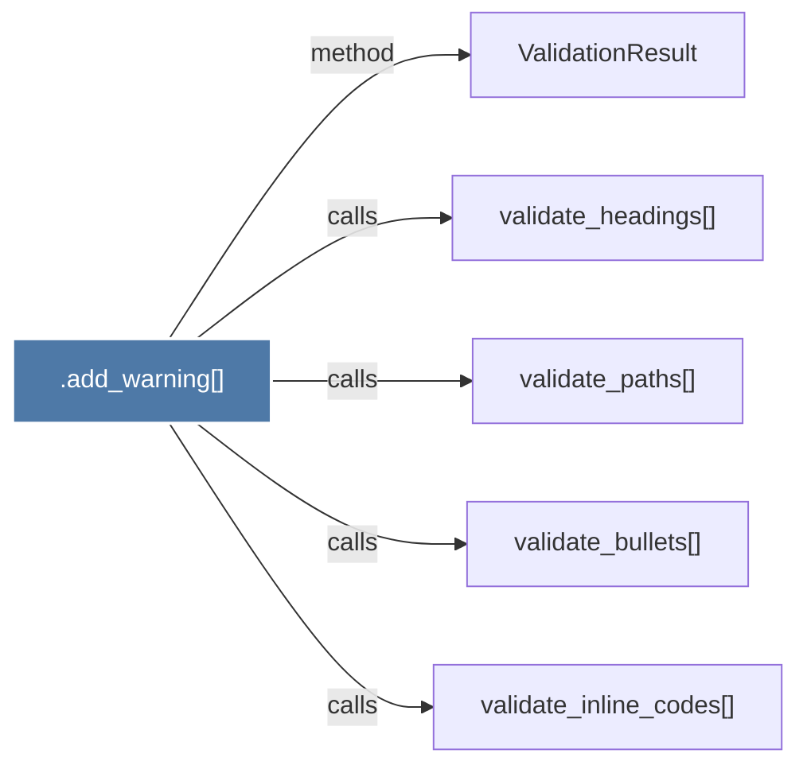

# .add_warning()

> [!info] Properties
> **File Type**: code
> **Community**: [[_COMMUNITY_Community None|Community None]]
> **Degree**: 5

## Architecture Graph


## Outbound Connections
- [[ValidationResult]] - `method` [EXTRACTED]
- [[validate_bullets()]] - `calls` [EXTRACTED]
- [[validate_headings()]] - `calls` [EXTRACTED]
- [[validate_inline_codes()]] - `calls` [EXTRACTED]
- [[validate_paths()]] - `calls` [EXTRACTED]

## Inbound Dependencies
> [!abstract]- Files that link here
```dataview
LIST
FROM [[.add_warning()]]
```

#graphify/code #graphify/EXTRACTED #community/Community_None