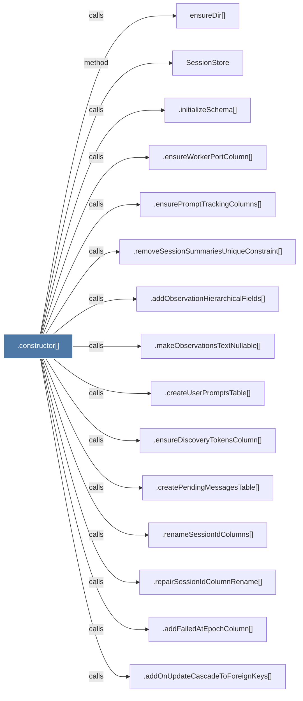

# .constructor()

> [!info] Properties
> **File Type**: code
> **Community**: [[_COMMUNITY_Community None|Community None]]
> **Degree**: 26

## Architecture Graph


## Outbound Connections
- [[.addFailedAtEpochColumn()]] - `calls` [EXTRACTED]
- [[.addObservationContentHashColumn()]] - `calls` [EXTRACTED]
- [[.addObservationHierarchicalFields()]] - `calls` [EXTRACTED]
- [[.addObservationModelColumns()]] - `calls` [EXTRACTED]
- [[.addObservationSubagentColumns()]] - `calls` [EXTRACTED]
- [[.addObservationsMetadataColumn()]] - `calls` [EXTRACTED]
- [[.addObservationsUniqueContentHashIndex()]] - `calls` [EXTRACTED]
- [[.addOnUpdateCascadeToForeignKeys()]] - `calls` [EXTRACTED]
- [[.addPendingMessagesToolUseIdAndWorkerPidColumns()]] - `calls` [EXTRACTED]
- [[.addSessionCustomTitleColumn()]] - `calls` [EXTRACTED]
- [[.addSessionPlatformSourceColumn()]] - `calls` [EXTRACTED]
- [[.createPendingMessagesTable()]] - `calls` [EXTRACTED]
- [[.createUserPromptsTable()]] - `calls` [EXTRACTED]
- [[.dropDeadPendingMessagesColumns()]] - `calls` [EXTRACTED]
- [[.dropWorkerPidColumn()]] - `calls` [EXTRACTED]
- [[.ensureDiscoveryTokensColumn()]] - `calls` [EXTRACTED]
- [[.ensureMergedIntoProjectColumns()]] - `calls` [EXTRACTED]
- [[.ensurePromptTrackingColumns()]] - `calls` [EXTRACTED]
- [[.ensureWorkerPortColumn()]] - `calls` [EXTRACTED]
- [[.initializeSchema()]] - `calls` [EXTRACTED]
- [[.makeObservationsTextNullable()]] - `calls` [EXTRACTED]
- [[.removeSessionSummariesUniqueConstraint()]] - `calls` [EXTRACTED]
- [[.renameSessionIdColumns()]] - `calls` [EXTRACTED]
- [[.repairSessionIdColumnRename()]] - `calls` [EXTRACTED]
- [[SessionStore]] - `method` [EXTRACTED]
- [[ensureDir()]] - `calls` [INFERRED]

## Inbound Dependencies
> [!abstract]- Files that link here
```dataview
LIST
FROM [[.constructor()_36]]
```

#graphify/code #graphify/EXTRACTED #community/Community_None