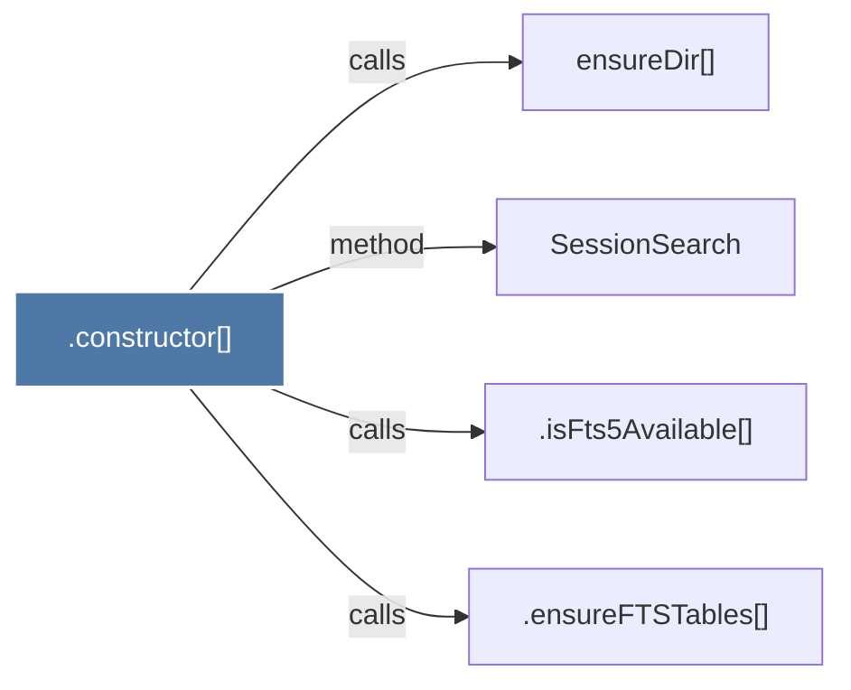

# .constructor()

> [!info] Properties
> **File Type**: code
> **Community**: [[_COMMUNITY_Community None|Community None]]
> **Degree**: 4

## Architecture Graph


## Outbound Connections
- [[.ensureFTSTables()]] - `calls` [EXTRACTED]
- [[.isFts5Available()]] - `calls` [EXTRACTED]
- [[SessionSearch]] - `method` [EXTRACTED]
- [[ensureDir()]] - `calls` [INFERRED]

## Inbound Dependencies
> [!abstract]- Files that link here
```dataview
LIST
FROM [[.constructor()_38]]
```

#graphify/code #graphify/EXTRACTED #community/Community_None