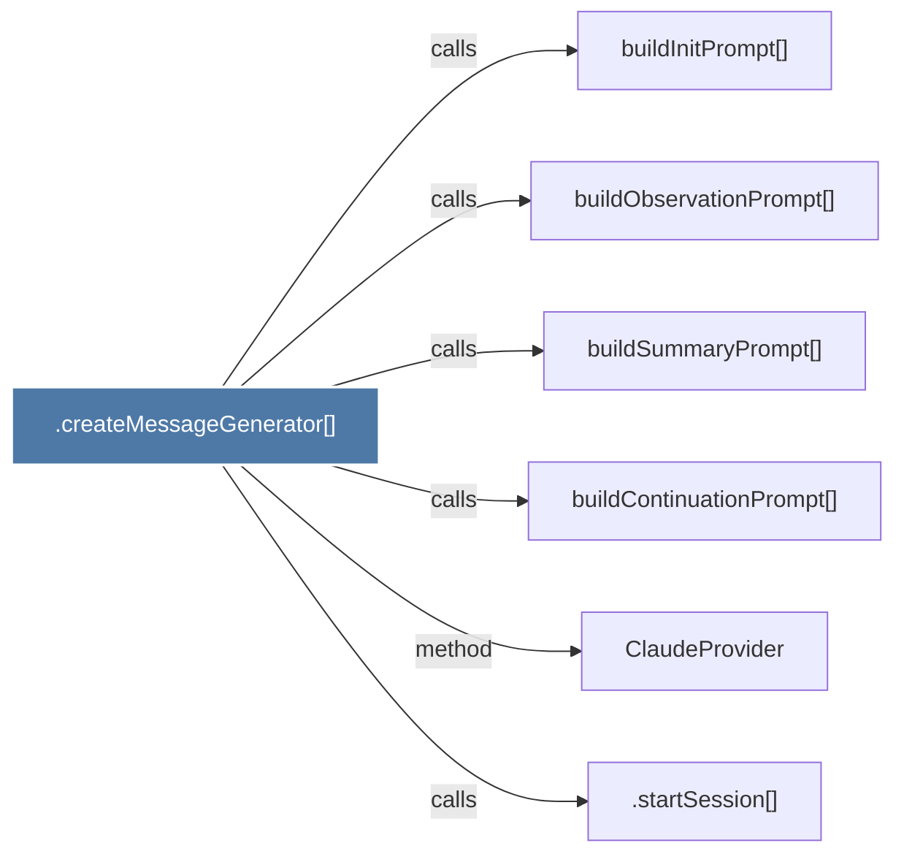

# .createMessageGenerator()

> [!info] Properties
> **File Type**: code
> **Community**: [[_COMMUNITY_Community None|Community None]]
> **Degree**: 6

## Architecture Graph


## Outbound Connections
- [[.startSession()]] - `calls` [EXTRACTED]
- [[ClaudeProvider]] - `method` [EXTRACTED]
- [[buildContinuationPrompt()]] - `calls` [INFERRED]
- [[buildInitPrompt()]] - `calls` [INFERRED]
- [[buildObservationPrompt()]] - `calls` [INFERRED]
- [[buildSummaryPrompt()]] - `calls` [INFERRED]

## Inbound Dependencies
> [!abstract]- Files that link here
```dataview
LIST
FROM [[.createMessageGenerator()]]
```

#graphify/code #graphify/INFERRED #community/Community_None