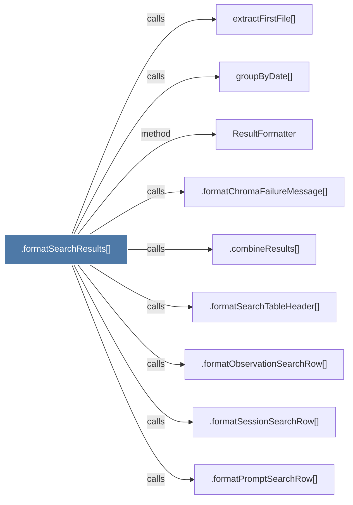

# .formatSearchResults()

> [!info] Properties
> **File Type**: code
> **Community**: [[_COMMUNITY_Community None|Community None]]
> **Degree**: 9

## Architecture Graph


## Outbound Connections
- [[.combineResults()]] - `calls` [EXTRACTED]
- [[.formatChromaFailureMessage()]] - `calls` [EXTRACTED]
- [[.formatObservationSearchRow()_1]] - `calls` [EXTRACTED]
- [[.formatPromptSearchRow()]] - `calls` [EXTRACTED]
- [[.formatSearchTableHeader()_1]] - `calls` [EXTRACTED]
- [[.formatSessionSearchRow()_1]] - `calls` [EXTRACTED]
- [[ResultFormatter]] - `method` [EXTRACTED]
- [[extractFirstFile()]] - `calls` [INFERRED]
- [[groupByDate()]] - `calls` [INFERRED]

## Inbound Dependencies
> [!abstract]- Files that link here
```dataview
LIST
FROM [[.formatSearchResults()]]
```

#graphify/code #graphify/EXTRACTED #community/Community_None