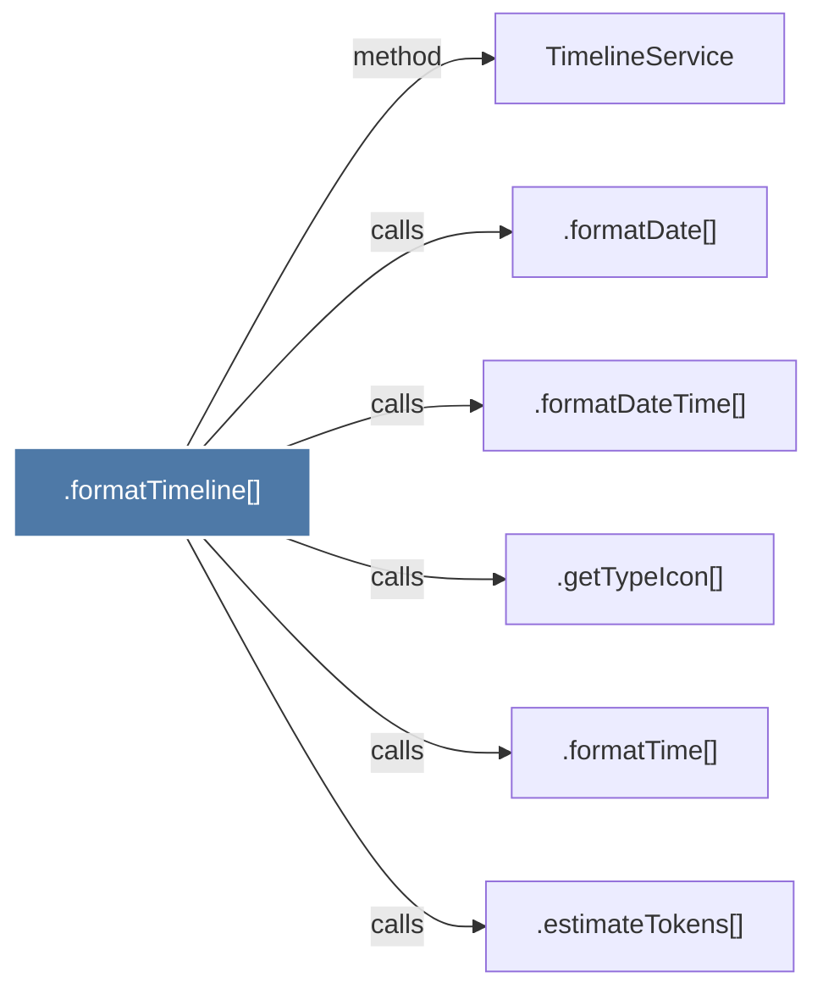

# .formatTimeline()

> [!info] Properties
> **File Type**: code
> **Community**: [[_COMMUNITY_Community None|Community None]]
> **Degree**: 6

## Architecture Graph


## Outbound Connections
- [[.estimateTokens()_1]] - `calls` [EXTRACTED]
- [[.formatDate()]] - `calls` [EXTRACTED]
- [[.formatDateTime()]] - `calls` [EXTRACTED]
- [[.formatTime()_1]] - `calls` [EXTRACTED]
- [[.getTypeIcon()]] - `calls` [EXTRACTED]
- [[TimelineService]] - `method` [EXTRACTED]

## Inbound Dependencies
> [!abstract]- Files that link here
```dataview
LIST
FROM [[.formatTimeline()]]
```

#graphify/code #graphify/EXTRACTED #community/Community_None