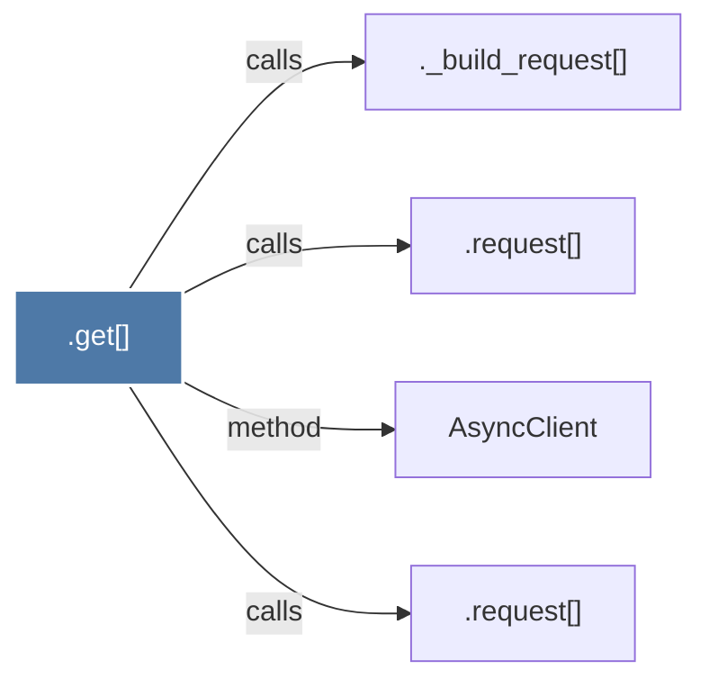

# .get()

> [!info] Properties
> **File Type**: code
> **Community**: [[_COMMUNITY_Community None|Community None]]
> **Degree**: 4

## Architecture Graph


## Outbound Connections
- [[._build_request()]] - `calls` [EXTRACTED]
- [[.request()]] - `calls` [EXTRACTED]
- [[.request()_1]] - `calls` [EXTRACTED]
- [[AsyncClient]] - `method` [EXTRACTED]

## Inbound Dependencies
> [!abstract]- Files that link here
```dataview
LIST
FROM [[.get()_4]]
```

#graphify/code #graphify/EXTRACTED #community/Community_None