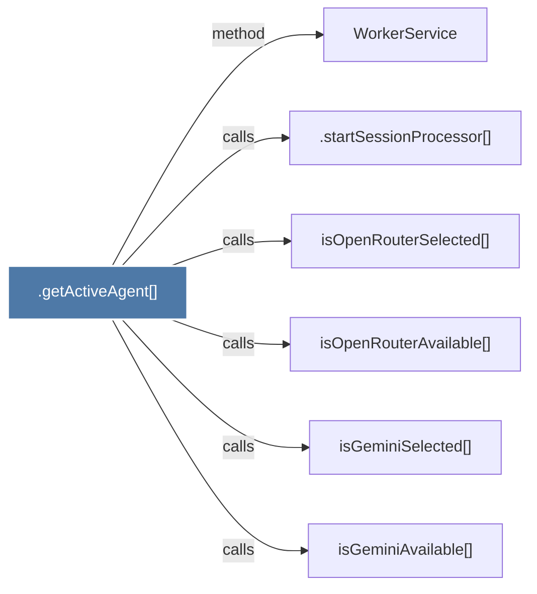

# .getActiveAgent()

> [!info] Properties
> **File Type**: code
> **Community**: [[_COMMUNITY_Community None|Community None]]
> **Degree**: 6

## Architecture Graph


## Outbound Connections
- [[.startSessionProcessor()]] - `calls` [EXTRACTED]
- [[WorkerService]] - `method` [EXTRACTED]
- [[isGeminiAvailable()]] - `calls` [INFERRED]
- [[isGeminiSelected()]] - `calls` [INFERRED]
- [[isOpenRouterAvailable()]] - `calls` [INFERRED]
- [[isOpenRouterSelected()]] - `calls` [INFERRED]

## Inbound Dependencies
> [!abstract]- Files that link here
```dataview
LIST
FROM [[.getActiveAgent()]]
```

#graphify/code #graphify/INFERRED #community/Community_None