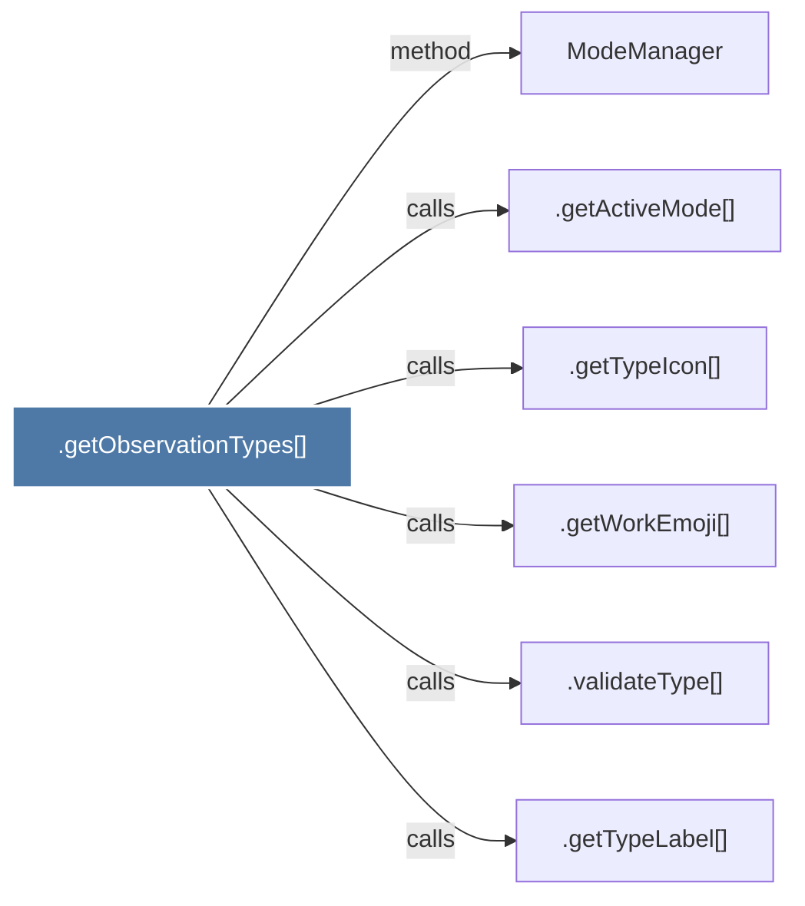

# .getObservationTypes()

> [!info] Properties
> **File Type**: code
> **Community**: [[_COMMUNITY_Community None|Community None]]
> **Degree**: 6

## Architecture Graph


## Outbound Connections
- [[.getActiveMode()]] - `calls` [EXTRACTED]
- [[.getTypeIcon()_1]] - `calls` [EXTRACTED]
- [[.getTypeLabel()]] - `calls` [EXTRACTED]
- [[.getWorkEmoji()]] - `calls` [EXTRACTED]
- [[.validateType()]] - `calls` [EXTRACTED]
- [[ModeManager]] - `method` [EXTRACTED]

## Inbound Dependencies
> [!abstract]- Files that link here
```dataview
LIST
FROM [[.getObservationTypes()]]
```

#graphify/code #graphify/EXTRACTED #community/Community_None