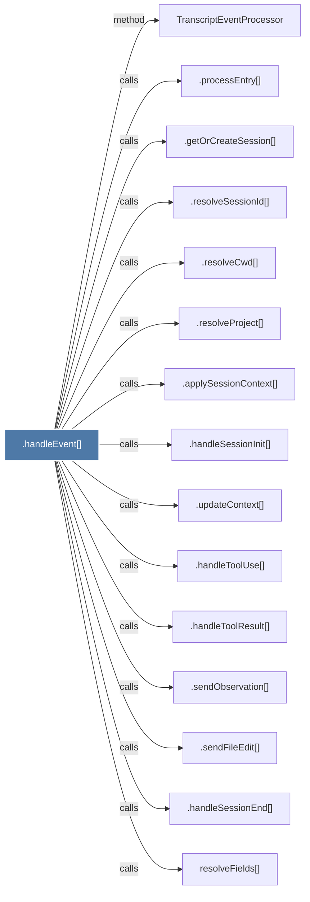

# .handleEvent()

> [!info] Properties
> **File Type**: code
> **Community**: [[_COMMUNITY_Community None|Community None]]
> **Degree**: 15

## Architecture Graph


## Outbound Connections
- [[.applySessionContext()]] - `calls` [EXTRACTED]
- [[.getOrCreateSession()]] - `calls` [EXTRACTED]
- [[.handleSessionEnd()]] - `calls` [EXTRACTED]
- [[.handleSessionInit()]] - `calls` [EXTRACTED]
- [[.handleToolResult()]] - `calls` [EXTRACTED]
- [[.handleToolUse()]] - `calls` [EXTRACTED]
- [[.processEntry()]] - `calls` [EXTRACTED]
- [[.resolveCwd()]] - `calls` [EXTRACTED]
- [[.resolveProject()]] - `calls` [EXTRACTED]
- [[.resolveSessionId()]] - `calls` [EXTRACTED]
- [[.sendFileEdit()]] - `calls` [EXTRACTED]
- [[.sendObservation()]] - `calls` [EXTRACTED]
- [[.updateContext()]] - `calls` [EXTRACTED]
- [[TranscriptEventProcessor]] - `method` [EXTRACTED]
- [[resolveFields()]] - `calls` [INFERRED]

## Inbound Dependencies
> [!abstract]- Files that link here
```dataview
LIST
FROM [[.handleEvent()]]
```

#graphify/code #graphify/EXTRACTED #community/Community_None