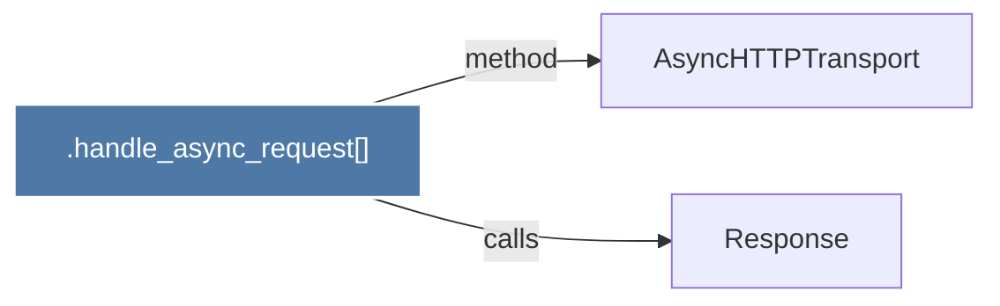

# .handle_async_request()

> [!info] Properties
> **File Type**: code
> **Community**: [[_COMMUNITY_Community None|Community None]]
> **Degree**: 2

## Architecture Graph


## Outbound Connections
- [[AsyncHTTPTransport]] - `method` [EXTRACTED]
- [[Response]] - `calls` [INFERRED]

## Inbound Dependencies
> [!abstract]- Files that link here
```dataview
LIST
FROM [[.handle_async_request()_1]]
```

#graphify/code #graphify/EXTRACTED #community/Community_None