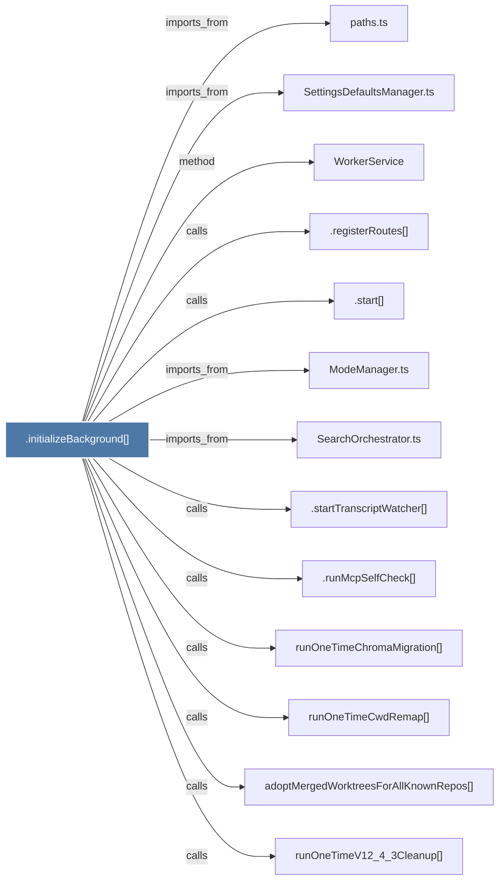

# .initializeBackground()

> [!info] Properties
> **File Type**: code
> **Community**: [[_COMMUNITY_Community None|Community None]]
> **Degree**: 13

## Architecture Graph


## Outbound Connections
- [[.registerRoutes()]] - `calls` [EXTRACTED]
- [[.runMcpSelfCheck()]] - `calls` [EXTRACTED]
- [[.start()]] - `calls` [EXTRACTED]
- [[.startTranscriptWatcher()]] - `calls` [EXTRACTED]
- [[ModeManager.ts]] - `imports_from` [EXTRACTED]
- [[SearchOrchestrator.ts]] - `imports_from` [EXTRACTED]
- [[SettingsDefaultsManager.ts]] - `imports_from` [EXTRACTED]
- [[WorkerService]] - `method` [EXTRACTED]
- [[adoptMergedWorktreesForAllKnownRepos()]] - `calls` [INFERRED]
- [[paths.ts]] - `imports_from` [EXTRACTED]
- [[runOneTimeChromaMigration()]] - `calls` [INFERRED]
- [[runOneTimeCwdRemap()]] - `calls` [INFERRED]
- [[runOneTimeV12_4_3Cleanup()]] - `calls` [INFERRED]

## Inbound Dependencies
> [!abstract]- Files that link here
```dataview
LIST
FROM [[.initializeBackground()]]
```

#graphify/code #graphify/EXTRACTED #community/Community_None