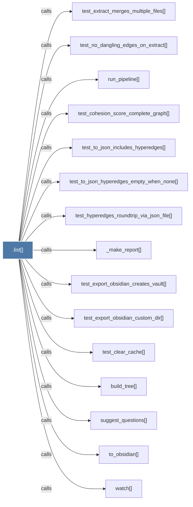

# .list()

> [!info] Properties
> **File Type**: code
> **Community**: [[_COMMUNITY_Community None|Community None]]
> **Degree**: 27

## Architecture Graph


## Outbound Connections
- [[CorpusStore]] - `method` [EXTRACTED]
- [[_make_report()]] - `calls` [INFERRED]
- [[build_merge()]] - `calls` [INFERRED]
- [[build_tree()]] - `calls` [INFERRED]
- [[deduplicate_by_label()]] - `calls` [INFERRED]
- [[deduplicate_entities()]] - `calls` [INFERRED]
- [[find_cross_references()]] - `calls` [INFERRED]
- [[handle_search()]] - `calls` [INFERRED]
- [[list_records()]] - `calls` [INFERRED]
- [[main()_2]] - `calls` [INFERRED]
- [[run_pipeline()]] - `calls` [INFERRED]
- [[save_state()]] - `calls` [INFERRED]
- [[select_instances()]] - `calls` [INFERRED]
- [[suggest_questions()]] - `calls` [INFERRED]
- [[suggest_questions()_1]] - `calls` [INFERRED]
- [[test_clear_cache()]] - `calls` [INFERRED]
- [[test_cohesion_score_complete_graph()]] - `calls` [INFERRED]
- [[test_export_obsidian_creates_vault()]] - `calls` [INFERRED]
- [[test_export_obsidian_custom_dir()]] - `calls` [INFERRED]
- [[test_extract_merges_multiple_files()]] - `calls` [INFERRED]
- [[test_hyperedges_roundtrip_via_json_file()]] - `calls` [INFERRED]
- [[test_no_dangling_edges_on_extract()]] - `calls` [INFERRED]
- [[test_to_json_hyperedges_empty_when_none()]] - `calls` [INFERRED]
- [[test_to_json_includes_hyperedges()]] - `calls` [INFERRED]
- [[to_obsidian()]] - `calls` [INFERRED]
- [[watch()]] - `calls` [INFERRED]
- [[xlsx_extract_structure()]] - `calls` [INFERRED]

## Inbound Dependencies
> [!abstract]- Files that link here
```dataview
LIST
FROM [[.list()]]
```

#graphify/code #graphify/INFERRED #community/Community_None