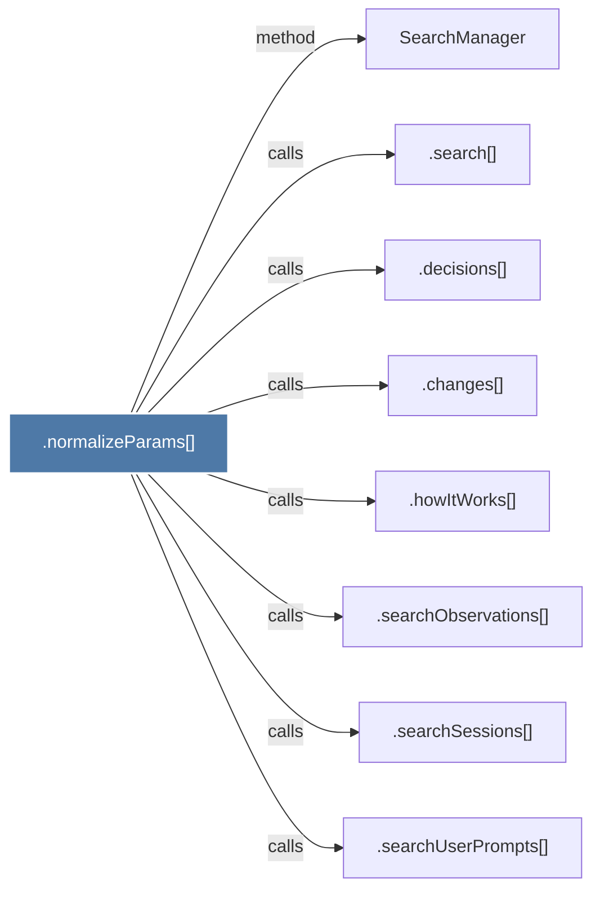

# .normalizeParams()

> [!info] Properties
> **File Type**: code
> **Community**: [[_COMMUNITY_Community None|Community None]]
> **Degree**: 8

## Architecture Graph


## Outbound Connections
- [[.changes()]] - `calls` [EXTRACTED]
- [[.decisions()]] - `calls` [EXTRACTED]
- [[.howItWorks()]] - `calls` [EXTRACTED]
- [[.search()]] - `calls` [EXTRACTED]
- [[.searchObservations()]] - `calls` [EXTRACTED]
- [[.searchSessions()]] - `calls` [EXTRACTED]
- [[.searchUserPrompts()]] - `calls` [EXTRACTED]
- [[SearchManager]] - `method` [EXTRACTED]

## Inbound Dependencies
> [!abstract]- Files that link here
```dataview
LIST
FROM [[.normalizeParams()]]
```

#graphify/code #graphify/EXTRACTED #community/Community_None