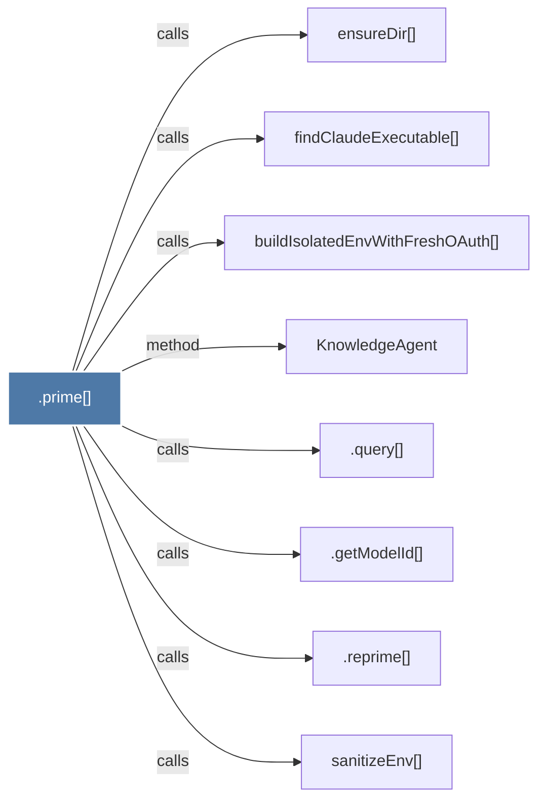

# .prime()

> [!info] Properties
> **File Type**: code
> **Community**: [[_COMMUNITY_Community None|Community None]]
> **Degree**: 8

## Architecture Graph


## Outbound Connections
- [[.getModelId()_1]] - `calls` [EXTRACTED]
- [[.query()]] - `calls` [EXTRACTED]
- [[.reprime()]] - `calls` [EXTRACTED]
- [[KnowledgeAgent]] - `method` [EXTRACTED]
- [[buildIsolatedEnvWithFreshOAuth()]] - `calls` [INFERRED]
- [[ensureDir()]] - `calls` [INFERRED]
- [[findClaudeExecutable()]] - `calls` [INFERRED]
- [[sanitizeEnv()]] - `calls` [INFERRED]

## Inbound Dependencies
> [!abstract]- Files that link here
```dataview
LIST
FROM [[.prime()]]
```

#graphify/code #graphify/INFERRED #community/Community_None