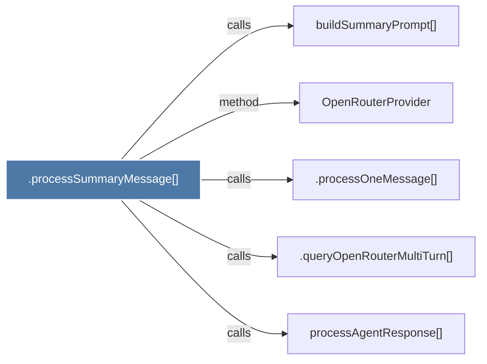

# .processSummaryMessage()

> [!info] Properties
> **File Type**: code
> **Community**: [[_COMMUNITY_Community None|Community None]]
> **Degree**: 5

## Architecture Graph


## Outbound Connections
- [[.processOneMessage()]] - `calls` [EXTRACTED]
- [[.queryOpenRouterMultiTurn()]] - `calls` [EXTRACTED]
- [[OpenRouterProvider]] - `method` [EXTRACTED]
- [[buildSummaryPrompt()]] - `calls` [INFERRED]
- [[processAgentResponse()]] - `calls` [INFERRED]

## Inbound Dependencies
> [!abstract]- Files that link here
```dataview
LIST
FROM [[.processSummaryMessage()]]
```

#graphify/code #graphify/EXTRACTED #community/Community_None