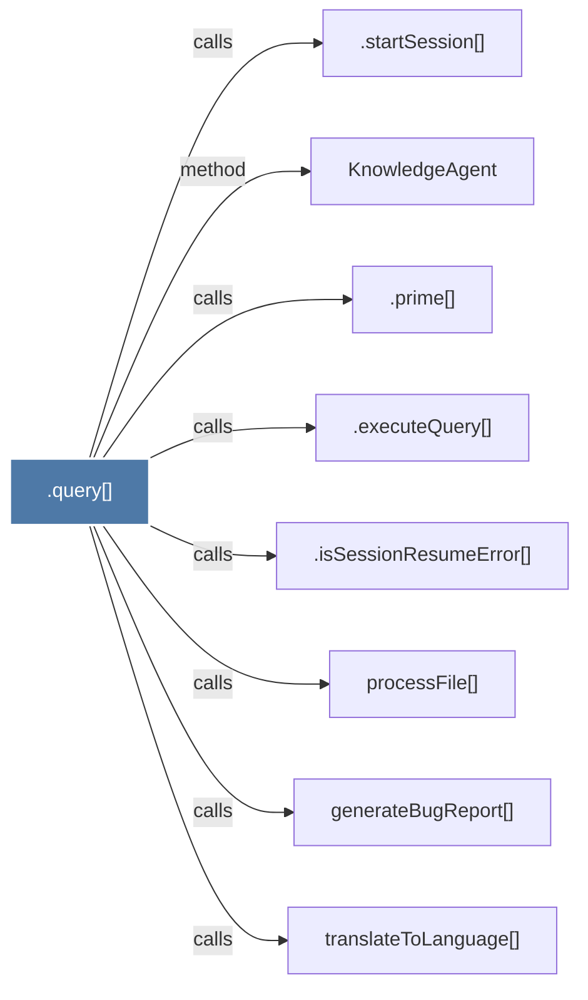

# .query()

> [!info] Properties
> **File Type**: code
> **Community**: [[_COMMUNITY_Community None|Community None]]
> **Degree**: 8

## Architecture Graph


## Outbound Connections
- [[.executeQuery()]] - `calls` [EXTRACTED]
- [[.isSessionResumeError()]] - `calls` [EXTRACTED]
- [[.prime()]] - `calls` [EXTRACTED]
- [[.startSession()]] - `calls` [INFERRED]
- [[KnowledgeAgent]] - `method` [EXTRACTED]
- [[generateBugReport()]] - `calls` [INFERRED]
- [[processFile()]] - `calls` [INFERRED]
- [[translateToLanguage()]] - `calls` [INFERRED]

## Inbound Dependencies
> [!abstract]- Files that link here
```dataview
LIST
FROM [[.query()]]
```

#graphify/code #graphify/INFERRED #community/Community_None