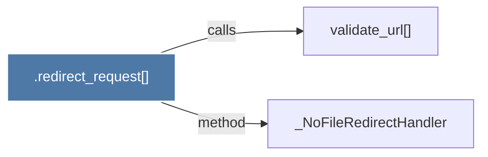

# .redirect_request()

> [!info] Properties
> **File Type**: code
> **Community**: [[_COMMUNITY_Community None|Community None]]
> **Degree**: 2

## Architecture Graph


## Outbound Connections
- [[_NoFileRedirectHandler]] - `method` [EXTRACTED]
- [[validate_url()]] - `calls` [EXTRACTED]

## Inbound Dependencies
> [!abstract]- Files that link here
```dataview
LIST
FROM [[.redirect_request()]]
```

#graphify/code #graphify/EXTRACTED #community/Community_None