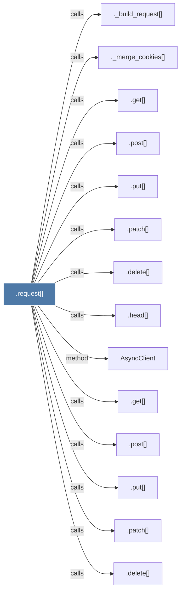

# .request()

> [!info] Properties
> **File Type**: code
> **Community**: [[_COMMUNITY_Community None|Community None]]
> **Degree**: 14

## Architecture Graph


## Outbound Connections
- [[._build_request()]] - `calls` [EXTRACTED]
- [[._merge_cookies()]] - `calls` [EXTRACTED]
- [[.delete()]] - `calls` [EXTRACTED]
- [[.delete()_1]] - `calls` [EXTRACTED]
- [[.get()_3]] - `calls` [EXTRACTED]
- [[.get()_4]] - `calls` [EXTRACTED]
- [[.head()]] - `calls` [EXTRACTED]
- [[.patch()]] - `calls` [EXTRACTED]
- [[.patch()_1]] - `calls` [EXTRACTED]
- [[.post()_2]] - `calls` [EXTRACTED]
- [[.post()_3]] - `calls` [EXTRACTED]
- [[.put()]] - `calls` [EXTRACTED]
- [[.put()_1]] - `calls` [EXTRACTED]
- [[AsyncClient]] - `method` [EXTRACTED]

## Inbound Dependencies
> [!abstract]- Files that link here
```dataview
LIST
FROM [[.request()_1]]
```

#graphify/code #graphify/EXTRACTED #community/Community_None