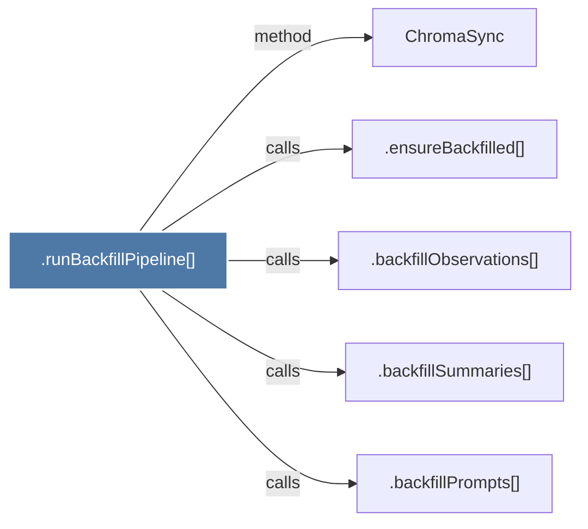

# .runBackfillPipeline()

> [!info] Properties
> **File Type**: code
> **Community**: [[_COMMUNITY_Community None|Community None]]
> **Degree**: 5

## Architecture Graph


## Outbound Connections
- [[.backfillObservations()]] - `calls` [EXTRACTED]
- [[.backfillPrompts()]] - `calls` [EXTRACTED]
- [[.backfillSummaries()]] - `calls` [EXTRACTED]
- [[.ensureBackfilled()]] - `calls` [EXTRACTED]
- [[ChromaSync]] - `method` [EXTRACTED]

## Inbound Dependencies
> [!abstract]- Files that link here
```dataview
LIST
FROM [[.runBackfillPipeline()]]
```

#graphify/code #graphify/EXTRACTED #community/Community_None