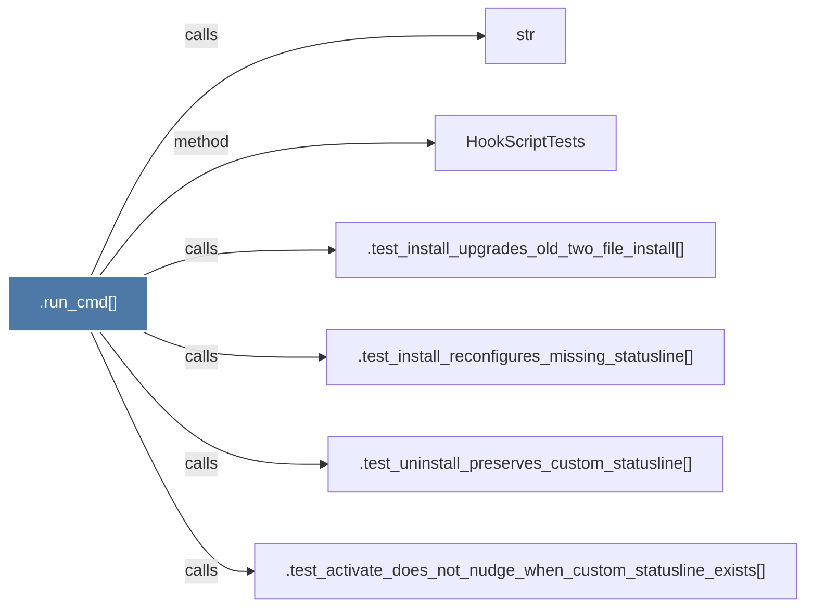

# .run_cmd()

> [!info] Properties
> **File Type**: code
> **Community**: [[_COMMUNITY_Community None|Community None]]
> **Degree**: 6

## Architecture Graph


## Outbound Connections
- [[.test_activate_does_not_nudge_when_custom_statusline_exists()]] - `calls` [EXTRACTED]
- [[.test_install_reconfigures_missing_statusline()]] - `calls` [EXTRACTED]
- [[.test_install_upgrades_old_two_file_install()]] - `calls` [EXTRACTED]
- [[.test_uninstall_preserves_custom_statusline()]] - `calls` [EXTRACTED]
- [[HookScriptTests]] - `method` [EXTRACTED]
- [[str]] - `calls` [INFERRED]

## Inbound Dependencies
> [!abstract]- Files that link here
```dataview
LIST
FROM [[.run_cmd()]]
```

#graphify/code #graphify/EXTRACTED #community/Community_None