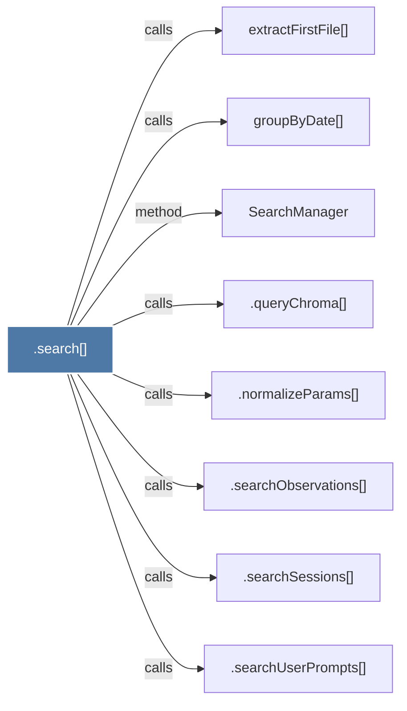

# .search()

> [!info] Properties
> **File Type**: code
> **Community**: [[_COMMUNITY_Community None|Community None]]
> **Degree**: 8

## Architecture Graph


## Outbound Connections
- [[.normalizeParams()]] - `calls` [EXTRACTED]
- [[.queryChroma()]] - `calls` [EXTRACTED]
- [[.searchObservations()]] - `calls` [EXTRACTED]
- [[.searchSessions()]] - `calls` [EXTRACTED]
- [[.searchUserPrompts()]] - `calls` [EXTRACTED]
- [[SearchManager]] - `method` [EXTRACTED]
- [[extractFirstFile()]] - `calls` [INFERRED]
- [[groupByDate()]] - `calls` [INFERRED]

## Inbound Dependencies
> [!abstract]- Files that link here
```dataview
LIST
FROM [[.search()]]
```

#graphify/code #graphify/EXTRACTED #community/Community_None