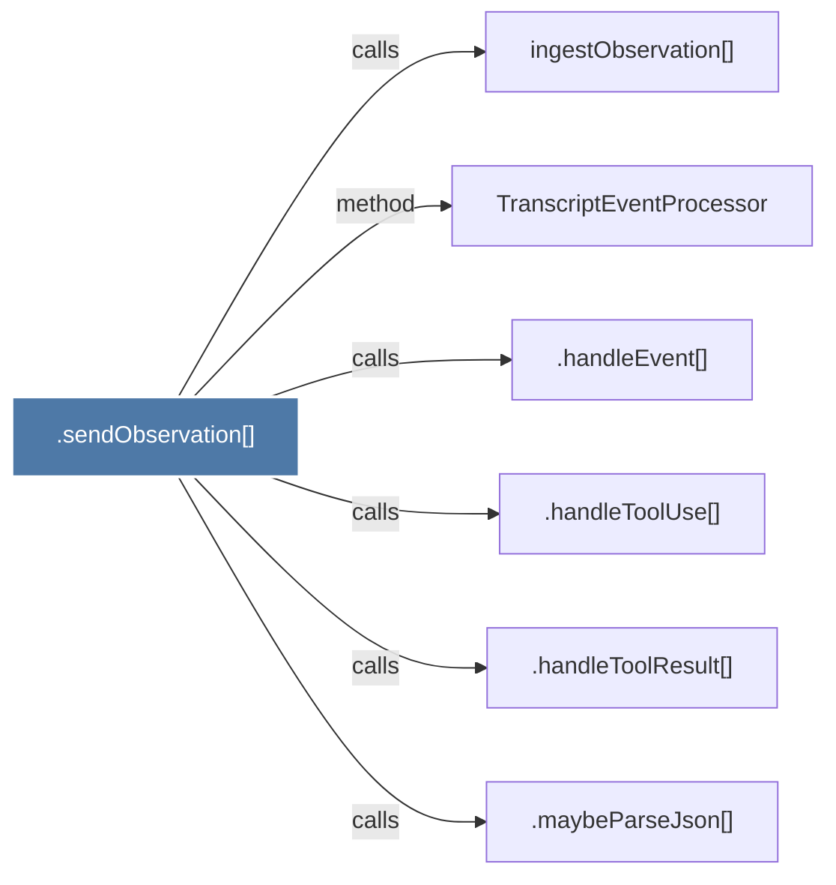

# .sendObservation()

> [!info] Properties
> **File Type**: code
> **Community**: [[_COMMUNITY_Community None|Community None]]
> **Degree**: 6

## Architecture Graph


## Outbound Connections
- [[.handleEvent()]] - `calls` [EXTRACTED]
- [[.handleToolResult()]] - `calls` [EXTRACTED]
- [[.handleToolUse()]] - `calls` [EXTRACTED]
- [[.maybeParseJson()]] - `calls` [EXTRACTED]
- [[TranscriptEventProcessor]] - `method` [EXTRACTED]
- [[ingestObservation()]] - `calls` [INFERRED]

## Inbound Dependencies
> [!abstract]- Files that link here
```dataview
LIST
FROM [[.sendObservation()]]
```

#graphify/code #graphify/EXTRACTED #community/Community_None