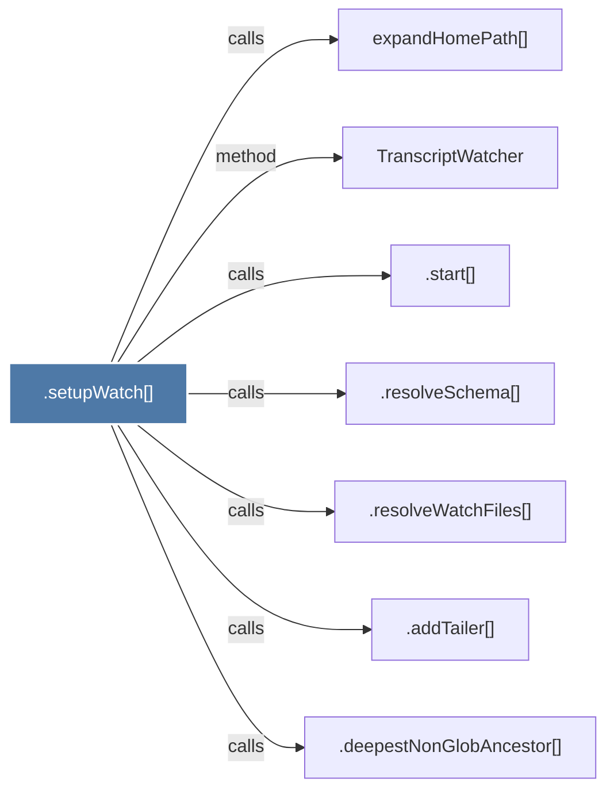

# .setupWatch()

> [!info] Properties
> **File Type**: code
> **Community**: [[_COMMUNITY_Community None|Community None]]
> **Degree**: 7

## Architecture Graph


## Outbound Connections
- [[.addTailer()]] - `calls` [EXTRACTED]
- [[.deepestNonGlobAncestor()]] - `calls` [EXTRACTED]
- [[.resolveSchema()]] - `calls` [EXTRACTED]
- [[.resolveWatchFiles()]] - `calls` [EXTRACTED]
- [[.start()_2]] - `calls` [EXTRACTED]
- [[TranscriptWatcher]] - `method` [EXTRACTED]
- [[expandHomePath()]] - `calls` [INFERRED]

## Inbound Dependencies
> [!abstract]- Files that link here
```dataview
LIST
FROM [[.setupWatch()]]
```

#graphify/code #graphify/EXTRACTED #community/Community_None