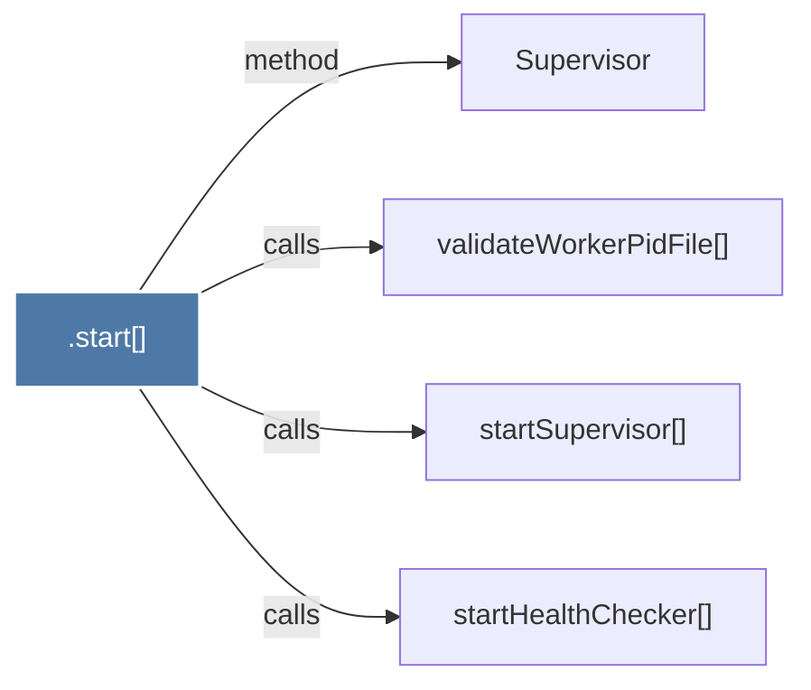

# .start()

> [!info] Properties
> **File Type**: code
> **Community**: [[_COMMUNITY_Community None|Community None]]
> **Degree**: 4

## Architecture Graph


## Outbound Connections
- [[Supervisor]] - `method` [EXTRACTED]
- [[startHealthChecker()]] - `calls` [INFERRED]
- [[startSupervisor()]] - `calls` [EXTRACTED]
- [[validateWorkerPidFile()]] - `calls` [EXTRACTED]

## Inbound Dependencies
> [!abstract]- Files that link here
```dataview
LIST
FROM [[.start()_3]]
```

#graphify/code #graphify/EXTRACTED #community/Community_None