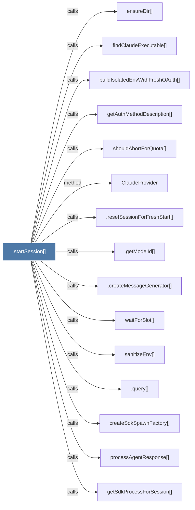

# .startSession()

> [!info] Properties
> **File Type**: code
> **Community**: [[_COMMUNITY_Community None|Community None]]
> **Degree**: 16

## Architecture Graph


## Outbound Connections
- [[.createMessageGenerator()]] - `calls` [EXTRACTED]
- [[.getModelId()]] - `calls` [EXTRACTED]
- [[.query()]] - `calls` [INFERRED]
- [[.resetSessionForFreshStart()]] - `calls` [EXTRACTED]
- [[ClaudeProvider]] - `method` [EXTRACTED]
- [[buildIsolatedEnvWithFreshOAuth()]] - `calls` [INFERRED]
- [[createSdkSpawnFactory()]] - `calls` [INFERRED]
- [[ensureDir()]] - `calls` [INFERRED]
- [[ensureSdkProcessExit()]] - `calls` [INFERRED]
- [[findClaudeExecutable()]] - `calls` [INFERRED]
- [[getAuthMethodDescription()]] - `calls` [INFERRED]
- [[getSdkProcessForSession()]] - `calls` [INFERRED]
- [[processAgentResponse()]] - `calls` [INFERRED]
- [[sanitizeEnv()]] - `calls` [INFERRED]
- [[shouldAbortForQuota()]] - `calls` [INFERRED]
- [[waitForSlot()]] - `calls` [INFERRED]

## Inbound Dependencies
> [!abstract]- Files that link here
```dataview
LIST
FROM [[.startSession()]]
```

#graphify/code #graphify/INFERRED #community/Community_None