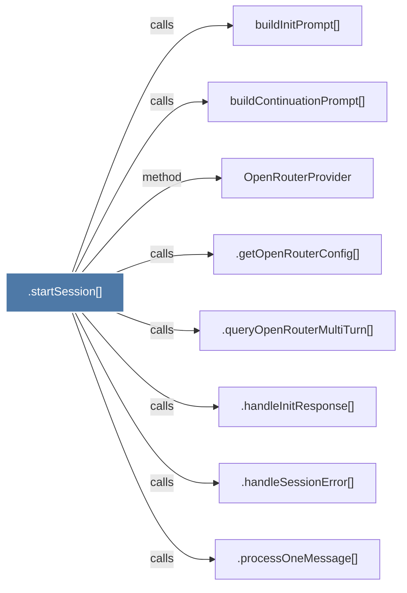

# .startSession()

> [!info] Properties
> **File Type**: code
> **Community**: [[_COMMUNITY_Community None|Community None]]
> **Degree**: 8

## Architecture Graph


## Outbound Connections
- [[.getOpenRouterConfig()]] - `calls` [EXTRACTED]
- [[.handleInitResponse()]] - `calls` [EXTRACTED]
- [[.handleSessionError()]] - `calls` [EXTRACTED]
- [[.processOneMessage()]] - `calls` [EXTRACTED]
- [[.queryOpenRouterMultiTurn()]] - `calls` [EXTRACTED]
- [[OpenRouterProvider]] - `method` [EXTRACTED]
- [[buildContinuationPrompt()]] - `calls` [INFERRED]
- [[buildInitPrompt()]] - `calls` [INFERRED]

## Inbound Dependencies
> [!abstract]- Files that link here
```dataview
LIST
FROM [[.startSession()_1]]
```

#graphify/code #graphify/EXTRACTED #community/Community_None