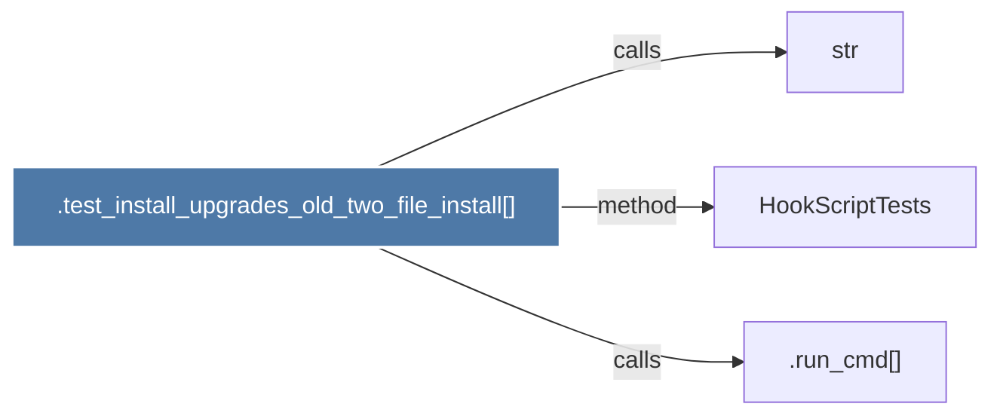

# .test_install_upgrades_old_two_file_install()

> [!info] Properties
> **File Type**: code
> **Community**: [[_COMMUNITY_Community None|Community None]]
> **Degree**: 3

## Architecture Graph


## Outbound Connections
- [[.run_cmd()]] - `calls` [EXTRACTED]
- [[HookScriptTests]] - `method` [EXTRACTED]
- [[str]] - `calls` [INFERRED]

## Inbound Dependencies
> [!abstract]- Files that link here
```dataview
LIST
FROM [[.test_install_upgrades_old_two_file_install()]]
```

#graphify/code #graphify/EXTRACTED #community/Community_None