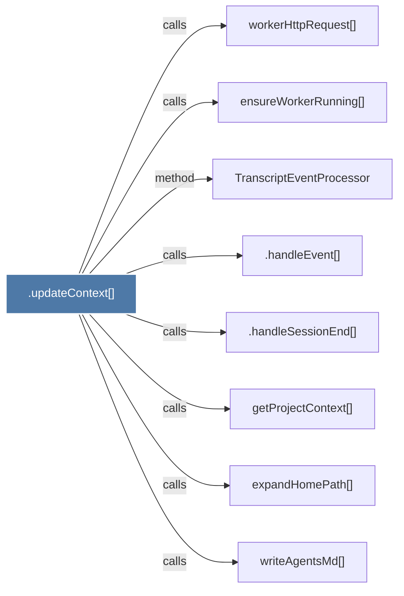

# .updateContext()

> [!info] Properties
> **File Type**: code
> **Community**: [[_COMMUNITY_Community None|Community None]]
> **Degree**: 8

## Architecture Graph


## Outbound Connections
- [[.handleEvent()]] - `calls` [EXTRACTED]
- [[.handleSessionEnd()]] - `calls` [EXTRACTED]
- [[TranscriptEventProcessor]] - `method` [EXTRACTED]
- [[ensureWorkerRunning()]] - `calls` [INFERRED]
- [[expandHomePath()]] - `calls` [INFERRED]
- [[getProjectContext()]] - `calls` [INFERRED]
- [[workerHttpRequest()]] - `calls` [INFERRED]
- [[writeAgentsMd()]] - `calls` [INFERRED]

## Inbound Dependencies
> [!abstract]- Files that link here
```dataview
LIST
FROM [[.updateContext()]]
```

#graphify/code #graphify/INFERRED #community/Community_None