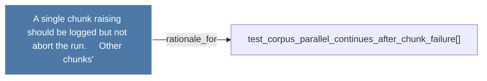

# A single chunk raising should be logged but not abort the run.     Other chunks'

> [!info] Properties
> **File Type**: rationale
> **Community**: [[_COMMUNITY_Community None|Community None]]
> **Degree**: 1

## Architecture Graph


## Outbound Connections
- [[test_corpus_parallel_continues_after_chunk_failure()]] - `rationale_for` [EXTRACTED]

## Inbound Dependencies
> [!abstract]- Files that link here
```dataview
LIST
FROM [[A single chunk raising should be logged but not abort the run.     Other chunks']]
```

#graphify/rationale #graphify/EXTRACTED #community/Community_None