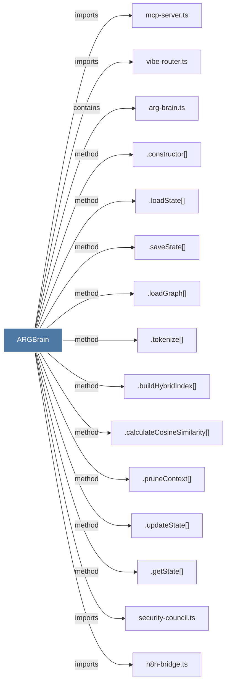

# ARGBrain

> [!info] Properties
> **File Type**: code
> **Community**: [[_COMMUNITY_Community None|Community None]]
> **Degree**: 19

## Architecture Graph


## Outbound Connections
- [[.buildHybridIndex()]] - `method` [EXTRACTED]
- [[.calculateCosineSimilarity()]] - `method` [EXTRACTED]
- [[.constructor()_52]] - `method` [EXTRACTED]
- [[.getState()]] - `method` [EXTRACTED]
- [[.loadGraph()]] - `method` [EXTRACTED]
- [[.loadState()]] - `method` [EXTRACTED]
- [[.pruneContext()]] - `method` [EXTRACTED]
- [[.saveState()]] - `method` [EXTRACTED]
- [[.tokenize()]] - `method` [EXTRACTED]
- [[.updateState()]] - `method` [EXTRACTED]
- [[arg-brain.ts]] - `contains` [EXTRACTED]
- [[audit_n8n_backbone.ts]] - `imports` [EXTRACTED]
- [[mcp-server.ts_1]] - `imports` [EXTRACTED]
- [[n8n-bridge.ts_1]] - `imports` [EXTRACTED]
- [[plugin-manager.ts]] - `imports` [EXTRACTED]
- [[recursive_audit.ts]] - `imports` [EXTRACTED]
- [[security-council.ts]] - `imports` [EXTRACTED]
- [[vibe-harden.ts]] - `imports` [EXTRACTED]
- [[vibe-router.ts]] - `imports` [EXTRACTED]

## Inbound Dependencies
> [!abstract]- Files that link here
```dataview
LIST
FROM [[ARGBrain]]
```

#graphify/code #graphify/EXTRACTED #community/Community_None