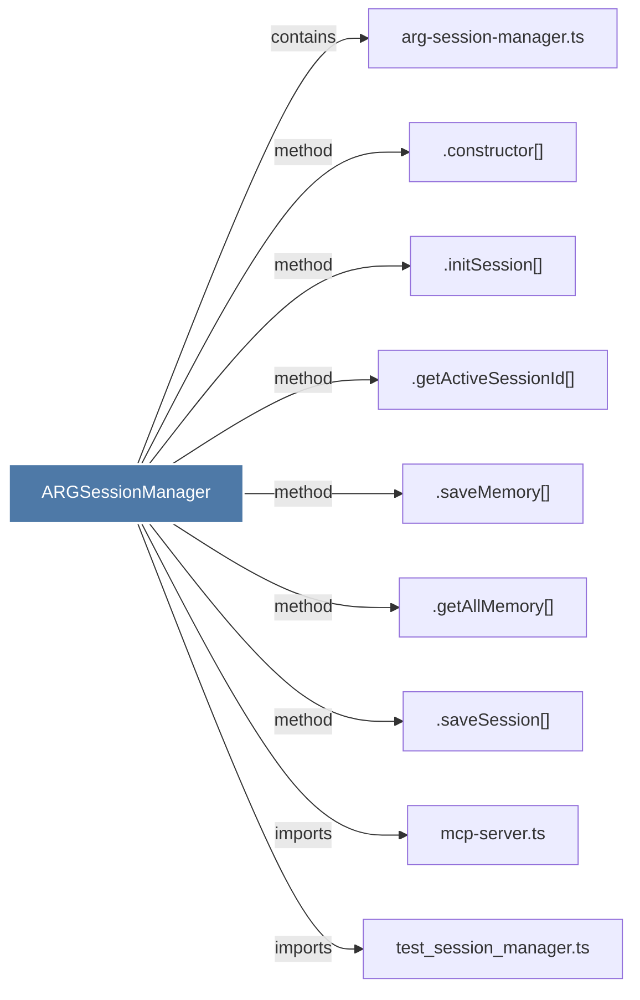

# ARGSessionManager

> [!info] Properties
> **File Type**: code
> **Community**: [[_COMMUNITY_Community None|Community None]]
> **Degree**: 9

## Architecture Graph


## Outbound Connections
- [[.constructor()_48]] - `method` [EXTRACTED]
- [[.getActiveSessionId()]] - `method` [EXTRACTED]
- [[.getAllMemory()]] - `method` [EXTRACTED]
- [[.initSession()]] - `method` [EXTRACTED]
- [[.saveMemory()]] - `method` [EXTRACTED]
- [[.saveSession()]] - `method` [EXTRACTED]
- [[arg-session-manager.ts]] - `contains` [EXTRACTED]
- [[mcp-server.ts_1]] - `imports` [EXTRACTED]
- [[test_session_manager.ts]] - `imports` [EXTRACTED]

## Inbound Dependencies
> [!abstract]- Files that link here
```dataview
LIST
FROM [[ARGSessionManager]]
```

#graphify/code #graphify/EXTRACTED #community/Community_None