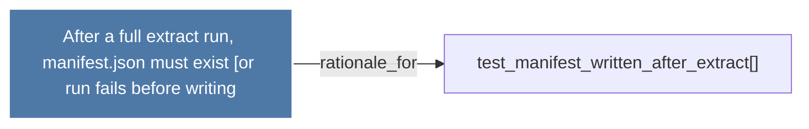

# After a full extract run, manifest.json must exist (or run fails before writing

> [!info] Properties
> **File Type**: rationale
> **Community**: [[_COMMUNITY_Community None|Community None]]
> **Degree**: 1

## Architecture Graph


## Outbound Connections
- [[test_manifest_written_after_extract()]] - `rationale_for` [EXTRACTED]

## Inbound Dependencies
> [!abstract]- Files that link here
```dataview
LIST
FROM [[After a full extract run, manifest.json must exist (or run fails before writing]]
```

#graphify/rationale #graphify/EXTRACTED #community/Community_None