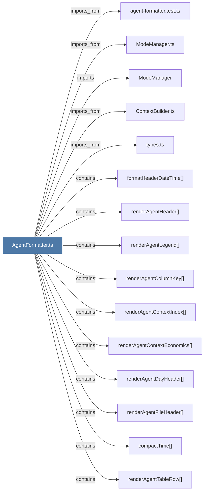

# AgentFormatter.ts

> [!info] Properties
> **File Type**: code
> **Community**: [[_COMMUNITY_Community None|Community None]]
> **Degree**: 25

## Architecture Graph


## Outbound Connections
- [[ContextBuilder.ts]] - `imports_from` [EXTRACTED]
- [[FooterRenderer.ts]] - `imports_from` [EXTRACTED]
- [[HeaderRenderer.ts]] - `imports_from` [EXTRACTED]
- [[ModeManager]] - `imports` [EXTRACTED]
- [[ModeManager.ts]] - `imports_from` [EXTRACTED]
- [[SummaryRenderer.ts]] - `imports_from` [EXTRACTED]
- [[TimelineRenderer.ts]] - `imports_from` [EXTRACTED]
- [[agent-formatter.test.ts]] - `imports_from` [EXTRACTED]
- [[compactTime()_1]] - `contains` [EXTRACTED]
- [[formatHeaderDateTime()_1]] - `contains` [EXTRACTED]
- [[renderAgentColumnKey()]] - `contains` [EXTRACTED]
- [[renderAgentContextEconomics()]] - `contains` [EXTRACTED]
- [[renderAgentContextIndex()]] - `contains` [EXTRACTED]
- [[renderAgentDayHeader()]] - `contains` [EXTRACTED]
- [[renderAgentEmptyState()]] - `contains` [EXTRACTED]
- [[renderAgentFileHeader()]] - `contains` [EXTRACTED]
- [[renderAgentFooter()]] - `contains` [EXTRACTED]
- [[renderAgentFullObservation()]] - `contains` [EXTRACTED]
- [[renderAgentHeader()]] - `contains` [EXTRACTED]
- [[renderAgentLegend()]] - `contains` [EXTRACTED]
- [[renderAgentPreviouslySection()]] - `contains` [EXTRACTED]
- [[renderAgentSummaryField()]] - `contains` [EXTRACTED]
- [[renderAgentSummaryItem()]] - `contains` [EXTRACTED]
- [[renderAgentTableRow()]] - `contains` [EXTRACTED]
- [[types.ts_12]] - `imports_from` [EXTRACTED]

## Inbound Dependencies
> [!abstract]- Files that link here
```dataview
LIST
FROM [[AgentFormatter.ts]]
```

#graphify/code #graphify/EXTRACTED #community/Community_None