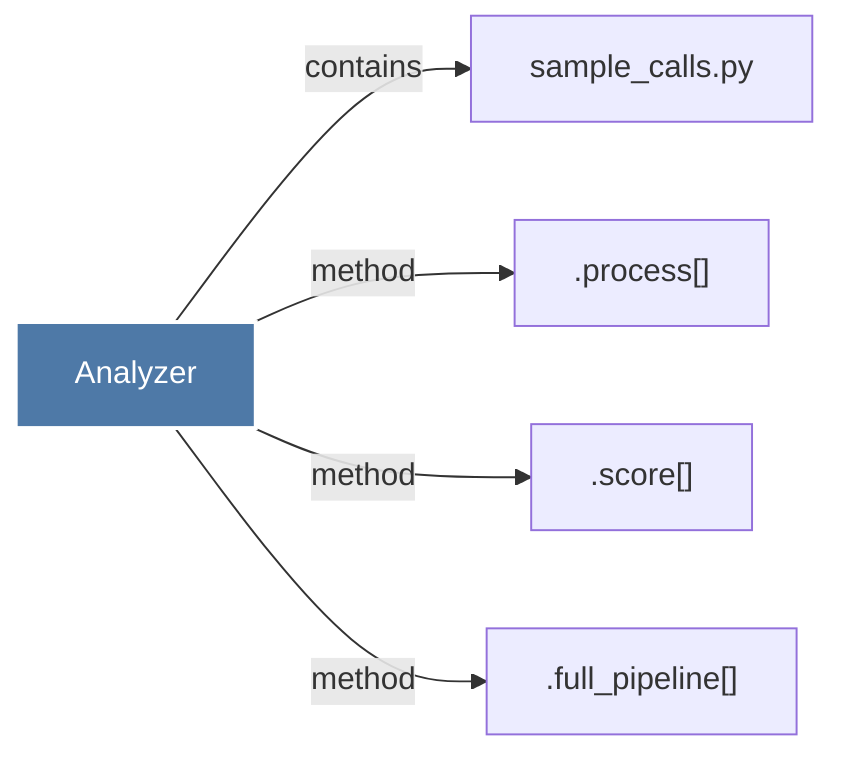

# Analyzer

> [!info] Properties
> **File Type**: code
> **Community**: [[_COMMUNITY_Community None|Community None]]
> **Degree**: 4

## Architecture Graph


## Outbound Connections
- [[.full_pipeline()]] - `method` [EXTRACTED]
- [[.process()]] - `method` [EXTRACTED]
- [[.score()]] - `method` [EXTRACTED]
- [[sample_calls.py]] - `contains` [EXTRACTED]

## Inbound Dependencies
> [!abstract]- Files that link here
```dataview
LIST
FROM [[Analyzer]]
```

#graphify/code #graphify/EXTRACTED #community/Community_None