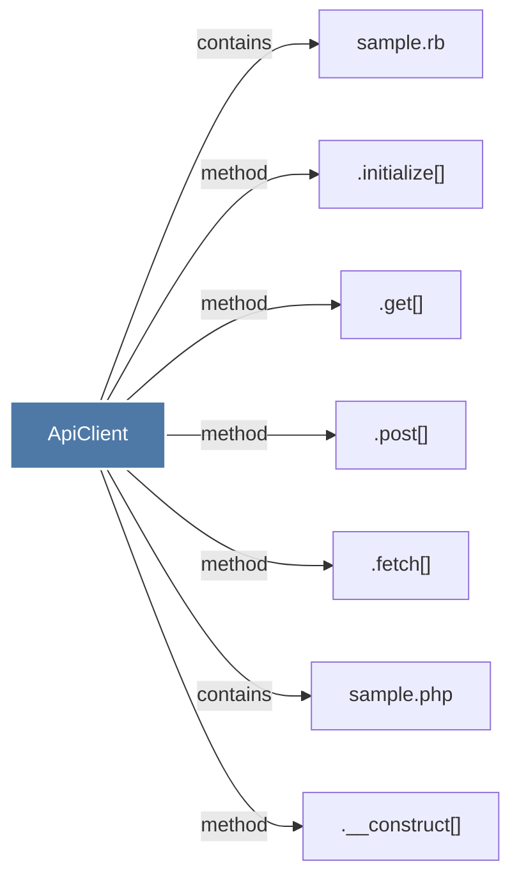

# ApiClient

> [!info] Properties
> **File Type**: code
> **Community**: [[_COMMUNITY_Community None|Community None]]
> **Degree**: 7

## Architecture Graph


## Outbound Connections
- [[.__construct()]] - `method` [EXTRACTED]
- [[.fetch()]] - `method` [EXTRACTED]
- [[.get()]] - `method` [EXTRACTED]
- [[.initialize()]] - `method` [EXTRACTED]
- [[.post()]] - `method` [EXTRACTED]
- [[sample.php]] - `contains` [EXTRACTED]
- [[sample.rb]] - `contains` [EXTRACTED]

## Inbound Dependencies
> [!abstract]- Files that link here
```dataview
LIST
FROM [[ApiClient]]
```

#graphify/code #graphify/EXTRACTED #community/Community_None