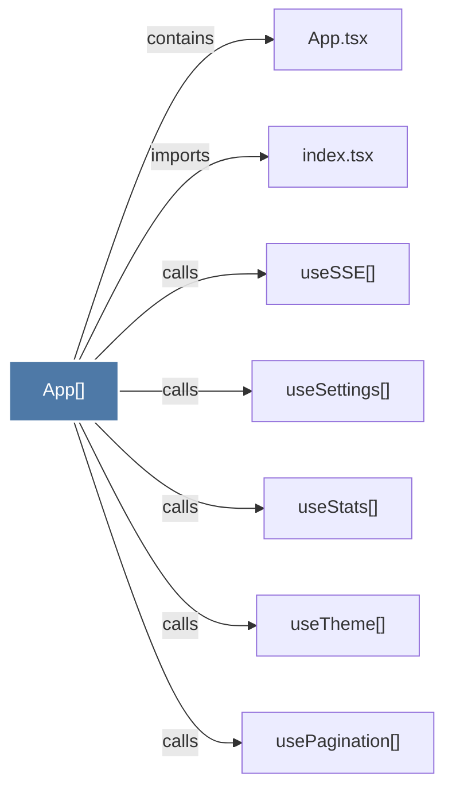

# App()

> [!info] Properties
> **File Type**: code
> **Community**: [[_COMMUNITY_Community None|Community None]]
> **Degree**: 7

## Architecture Graph


## Outbound Connections
- [[App.tsx]] - `contains` [EXTRACTED]
- [[index.tsx]] - `imports` [EXTRACTED]
- [[usePagination()]] - `calls` [INFERRED]
- [[useSSE()]] - `calls` [INFERRED]
- [[useSettings()]] - `calls` [INFERRED]
- [[useStats()]] - `calls` [INFERRED]
- [[useTheme()]] - `calls` [INFERRED]

## Inbound Dependencies
> [!abstract]- Files that link here
```dataview
LIST
FROM [[App()]]
```

#graphify/code #graphify/INFERRED #community/Community_None