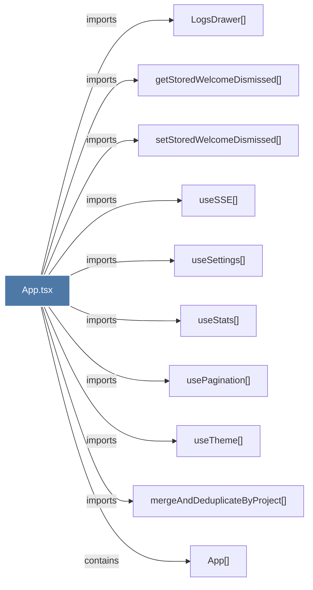

# App.tsx

> [!info] Properties
> **File Type**: code
> **Community**: [[_COMMUNITY_Community None|Community None]]
> **Degree**: 10

## Architecture Graph


## Outbound Connections
- [[App()]] - `contains` [EXTRACTED]
- [[LogsDrawer()]] - `imports` [EXTRACTED]
- [[getStoredWelcomeDismissed()]] - `imports` [EXTRACTED]
- [[mergeAndDeduplicateByProject()]] - `imports` [EXTRACTED]
- [[setStoredWelcomeDismissed()]] - `imports` [EXTRACTED]
- [[usePagination()]] - `imports` [EXTRACTED]
- [[useSSE()]] - `imports` [EXTRACTED]
- [[useSettings()]] - `imports` [EXTRACTED]
- [[useStats()]] - `imports` [EXTRACTED]
- [[useTheme()]] - `imports` [EXTRACTED]

## Inbound Dependencies
> [!abstract]- Files that link here
```dataview
LIST
FROM [[App.tsx]]
```

#graphify/code #graphify/EXTRACTED #community/Community_None