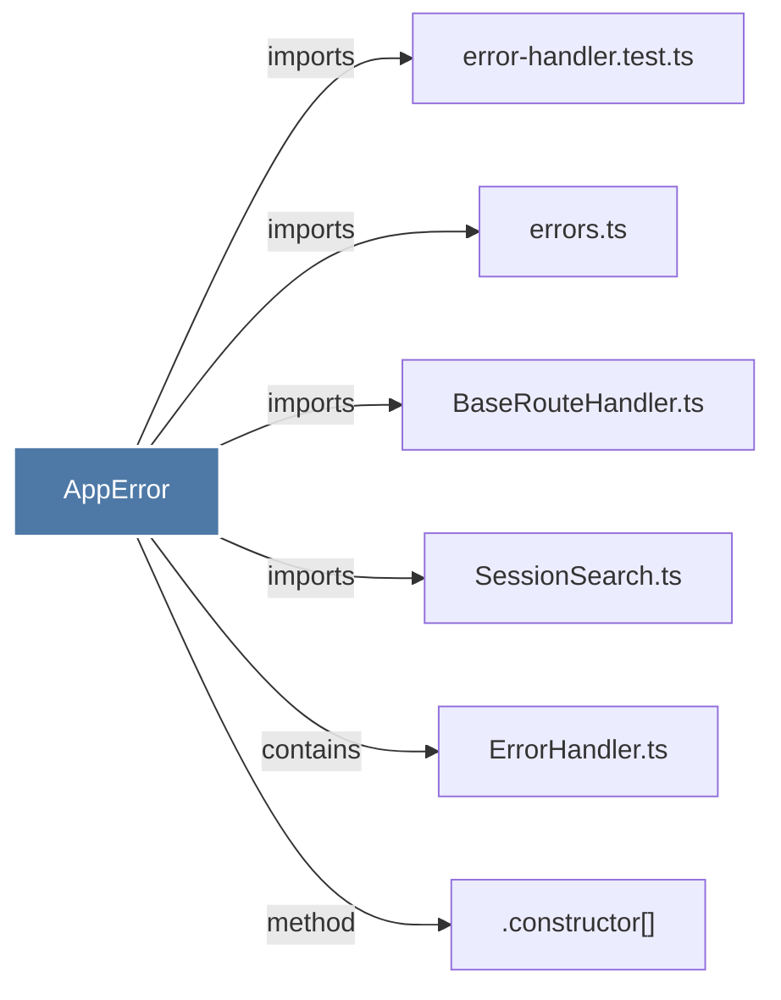

# AppError

> [!info] Properties
> **File Type**: code
> **Community**: [[_COMMUNITY_Community None|Community None]]
> **Degree**: 6

## Architecture Graph


## Outbound Connections
- [[.constructor()_40]] - `method` [EXTRACTED]
- [[BaseRouteHandler.ts]] - `imports` [EXTRACTED]
- [[ErrorHandler.ts]] - `contains` [EXTRACTED]
- [[SessionSearch.ts]] - `imports` [EXTRACTED]
- [[error-handler.test.ts]] - `imports` [EXTRACTED]
- [[errors.ts_1]] - `imports` [EXTRACTED]

## Inbound Dependencies
> [!abstract]- Files that link here
```dataview
LIST
FROM [[AppError]]
```

#graphify/code #graphify/EXTRACTED #community/Community_None