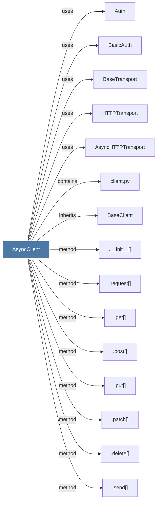

# AsyncClient

> [!info] Properties
> **File Type**: code
> **Community**: [[_COMMUNITY_Community None|Community None]]
> **Degree**: 26

## Architecture Graph


## Outbound Connections
- [[.__aenter__()]] - `method` [EXTRACTED]
- [[.__aexit__()]] - `method` [EXTRACTED]
- [[.__init__()_14]] - `method` [EXTRACTED]
- [[.aclose()_2]] - `method` [EXTRACTED]
- [[.delete()_1]] - `method` [EXTRACTED]
- [[.get()_4]] - `method` [EXTRACTED]
- [[.patch()_1]] - `method` [EXTRACTED]
- [[.post()_3]] - `method` [EXTRACTED]
- [[.put()_1]] - `method` [EXTRACTED]
- [[.request()_1]] - `method` [EXTRACTED]
- [[.send()_1]] - `method` [EXTRACTED]
- [[AsyncHTTPTransport]] - `uses` [INFERRED]
- [[Asynchronous HTTP client.]] - `rationale_for` [EXTRACTED]
- [[Auth]] - `uses` [INFERRED]
- [[BaseClient]] - `inherits` [EXTRACTED]
- [[BaseTransport]] - `uses` [INFERRED]
- [[BasicAuth]] - `uses` [INFERRED]
- [[Cookies]] - `uses` [INFERRED]
- [[HTTPTransport]] - `uses` [INFERRED]
- [[Headers]] - `uses` [INFERRED]
- [[InvalidURL]] - `uses` [INFERRED]
- [[Request]] - `uses` [INFERRED]
- [[Response]] - `uses` [INFERRED]
- [[TooManyRedirects]] - `uses` [INFERRED]
- [[URL]] - `uses` [INFERRED]
- [[client.py]] - `contains` [EXTRACTED]

## Inbound Dependencies
> [!abstract]- Files that link here
```dataview
LIST
FROM [[AsyncClient]]
```

#graphify/code #graphify/EXTRACTED #community/Community_None