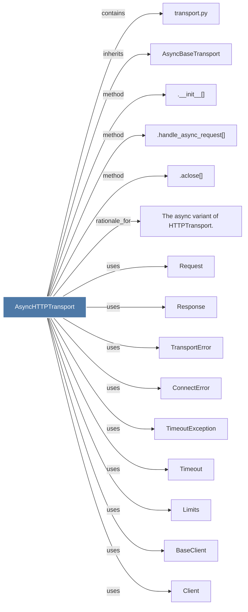

# AsyncHTTPTransport

> [!info] Properties
> **File Type**: code
> **Community**: [[_COMMUNITY_Community None|Community None]]
> **Degree**: 17

## Architecture Graph


## Outbound Connections
- [[.__init__()_7]] - `method` [EXTRACTED]
- [[.__init__()_14]] - `calls` [INFERRED]
- [[.aclose()_1]] - `method` [EXTRACTED]
- [[.handle_async_request()_1]] - `method` [EXTRACTED]
- [[AsyncBaseTransport]] - `inherits` [EXTRACTED]
- [[AsyncClient]] - `uses` [INFERRED]
- [[BaseClient]] - `uses` [INFERRED]
- [[Client]] - `uses` [INFERRED]
- [[ConnectError]] - `uses` [INFERRED]
- [[Limits]] - `uses` [INFERRED]
- [[Request]] - `uses` [INFERRED]
- [[Response]] - `uses` [INFERRED]
- [[The async variant of HTTPTransport.]] - `rationale_for` [EXTRACTED]
- [[Timeout]] - `uses` [INFERRED]
- [[TimeoutException]] - `uses` [INFERRED]
- [[TransportError]] - `uses` [INFERRED]
- [[transport.py]] - `contains` [EXTRACTED]

## Inbound Dependencies
> [!abstract]- Files that link here
```dataview
LIST
FROM [[AsyncHTTPTransport]]
```

#graphify/code #graphify/INFERRED #community/Community_None