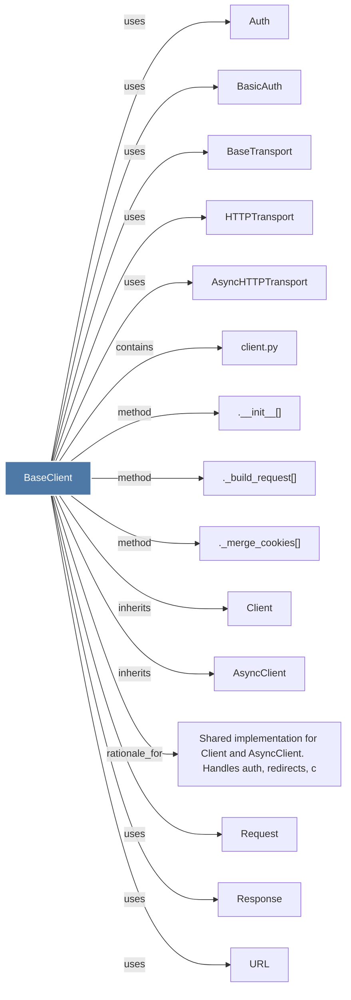

# BaseClient

> [!info] Properties
> **File Type**: code
> **Community**: [[_COMMUNITY_Community None|Community None]]
> **Degree**: 19

## Architecture Graph


## Outbound Connections
- [[.__init__()_12]] - `method` [EXTRACTED]
- [[._build_request()]] - `method` [EXTRACTED]
- [[._merge_cookies()]] - `method` [EXTRACTED]
- [[AsyncClient]] - `inherits` [EXTRACTED]
- [[AsyncHTTPTransport]] - `uses` [INFERRED]
- [[Auth]] - `uses` [INFERRED]
- [[BaseTransport]] - `uses` [INFERRED]
- [[BasicAuth]] - `uses` [INFERRED]
- [[Client]] - `inherits` [EXTRACTED]
- [[Cookies]] - `uses` [INFERRED]
- [[HTTPTransport]] - `uses` [INFERRED]
- [[Headers]] - `uses` [INFERRED]
- [[InvalidURL]] - `uses` [INFERRED]
- [[Request]] - `uses` [INFERRED]
- [[Response]] - `uses` [INFERRED]
- [[Shared implementation for Client and AsyncClient.     Handles auth, redirects, c]] - `rationale_for` [EXTRACTED]
- [[TooManyRedirects]] - `uses` [INFERRED]
- [[URL]] - `uses` [INFERRED]
- [[client.py]] - `contains` [EXTRACTED]

## Inbound Dependencies
> [!abstract]- Files that link here
```dataview
LIST
FROM [[BaseClient]]
```

#graphify/code #graphify/INFERRED #community/Community_None